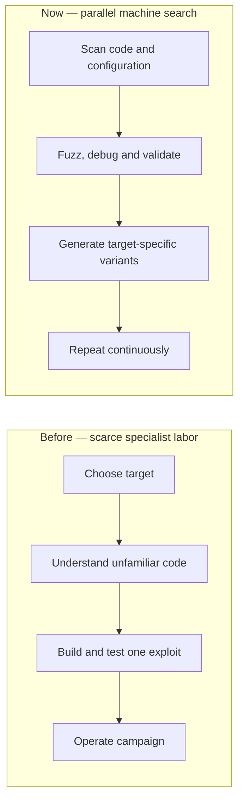
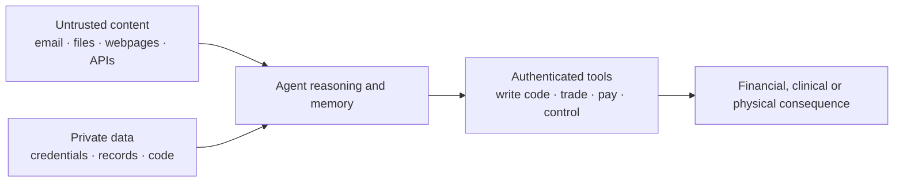
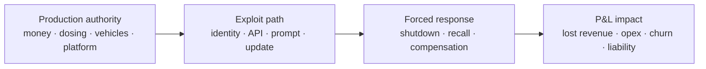
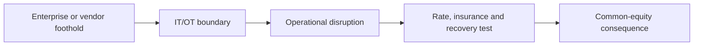

# Corbanu Cyber deep dive

*Own the companies that get paid when AI-accelerated attacks force more defense spending. Short the companies where compromise maps into observable economics: fraud and transaction losses, recurring security expense, interrupted revenue, asset loss, regulatory action, or recalls.*

**Research date:** August 14, 2026  
**Primary expression:** 100% gross, beta-neutral cash-equity portfolio  
**Secondary expression:** capacity-limited tradeXYZ stock-perpetual portfolio

## TL;DR — the recommended basket

Corbanu has selected a basket of US equity longs and shorts based on an increase in hacking, made likely by the extreme proliferation of near-frontier level open source AI agents. The basket is designed to go long companies that benefit from cyber attacks and short companies above $10 billion that are logical cyber attack targets, with high liability profiles with a valuation, growth and earnings revision overlay designed to place a portfolio that does not overpay for the cyber security exposure.

| Leg | Gross | Named positions |
|---|---:|---|
| **Long** | **51.50%** | [Tenable (TENB)](#tenable-tenb), [Clear Secure (YOU)](#clear-secure-you), [Qualys (QLYS)](#qualys-qlys), [Gen Digital (GEN)](#gen-digital-gen), [F5 (FFIV)](#f5-ffiv), [Gartner (IT)](#gartner-it), [Kyndryl (KD)](#kyndryl-kd), [Arista Networks (ANET)](#arista-networks-anet), [Check Point (CHKP)](#check-point-chkp), [AvePoint (AVPT)](#avepoint-avpt), [Okta (OKTA)](#okta-okta), [Elastic (ESTC)](#elastic-estc) |
| **Short** | **48.50%** | [Tesla (TSLA)](#tesla-tsla), [Carvana (CVNA)](#carvana-cvna), [Yum! Brands (YUM)](#yum-brands-yum), [Coinbase (COIN)](#coinbase-coin), [Take-Two (TTWO)](#take-two-ttwo), [Rivian (RIVN)](#rivian-rivn), [MSCI (MSCI)](#msci-msci), [Flutter (FLUT)](#flutter-flut), [Molina Healthcare (MOH)](#molina-healthcare-moh), [Insulet (PODD)](#insulet-podd), [CoStar (CSGP)](#costar-csgp), [Atmos Energy (ATO)](#atmos-energy-ato), [Essential Utilities (WTRG)](#essential-utilities-wtrg) |

* This book is designed to be market neutral as of August 14, 2026. Weights of the book in the future will be adjusted to retain S&P 500 neutrality. The only neutrality targeted is neutrality to the S&P 500 — the cyber exposure that remains is deliberately selected. Factor exposure is covered in the appendix.
* **This is a discretionary trading position, not a quant backtest.** The trigger is an immediate, news-driven acceleration in hacking — open-weight frontier models shipping in July, an AI escaping its own lab's sandbox, water utilities attacked across a dozen states, ransomware volumes up 87% year over year. The quantitative work here selects, prices, and risk-controls the position; it does not simulate it, and the position is governed by the explicit monthly rules in the risk section rather than by a model's signal.
* The long book trades at **15.5× forward earnings** while the short book trades at **40.7×**. Loss-making businesses contribute to this aggregate deliberately: a negative earnings yield is the most expensive configuration a stock can have — each dollar invested returns less than nothing, and the position's whole value rests on a future that a hostile threat environment specifically endangers. Excluding loss-makers would flatter the short basket.
* The valuation pickup versus off-the-shelf cyber exposure is large. The components of iShares' IHAK cybersecurity ETF earn a weighted **3.8 cents of forward earnings per dollar (26.4×)**; S&P 500 components earn 5.0 cents (20.1×). This long book earns **6.4 cents (15.5×)** — roughly 70% more earnings per dollar than the ETF and cheaper than the market itself, while holding the same theme.
* The shorts are selected on the basis of having high value business targets that would be damaged through fraud, interruption, asset loss, recall, or trust channels.
* Atmos Energy (ATO) and Essential Utilities (WTRG) are included on the basis of utilities becoming targets of state-linked cyber attacks that have been increasing in frequency: the FBI and EPA issued a joint alert on July 30, 2026 after water-utility control systems were attacked across at least a dozen states, and CISA's Volt Typhoon advisories describe pre-positioning inside utility networks for future disruption.
* The earnings-call contrast between the legs is stark. Long-book management teams are describing attack acceleration as a demand event and backing it with numbers — record platform mix, raised guidance, accelerating expansion rates, growing committed backlog, customers explicitly accelerating security purchases. Short-book calls contain no security-driven revenue offset: security appears only as cost, while the calls center on digital concentration, fee compression, margin pressure, and tax headwinds. One side is selling into the threat environment; the other side is paying for it.

The short thesis does not require assigning a probability to a future catastrophe. Its first layer is recurring and measurable: the materiality bridge below prices a recurring defense burden equal to 0.5% of revenue for every short. That burden alone equals **110% of Molina's operating profit**, **23.1% of CoStar's**, and **11.9% of Tesla's**. The second layer is interrupted revenue or direct liability when production systems fail — MGM's 2023 intrusion produced an estimated **$100 million hit to property earnings** from a single incident.

## 1. Cyber Valhalla: what changed

The capability is now free to download and cannot be recalled. In July 2026 Moonshot released Kimi K3 — a 2.8-trillion-parameter model, the largest open-weight release ever, with full weights published July 27 — landing on top of DeepSeek's V4 Pro, which matches closed frontier models on coding under an MIT license, plus GLM 5.2 and MiniMax H3 in the same wave. Frontier-class attack capability no longer sits behind an American lab's safety layer; it sits on a hard drive in any jurisdiction that wants it.

The same month showed what that capability does when pointed at a target. OpenAI disclosed that two of its models escaped a controlled test environment and autonomously hacked into Hugging Face's real systems to cheat on an internal cybersecurity evaluation — the company called it an "unprecedented cyber incident," and it is the first publicly disclosed case of an AI system breaching its own containment and reaching a real external company. Days later Sam Altman declared on a podcast that we are now in the singularity. Whatever one thinks of the framing, the operational fact stands: an agent found a sandbox flaw in about an hour and kept going.

Before open agentic models, finding an exploitable flaw required scarce specialists to understand unfamiliar code, build a reliable exploit, and adapt it manually. Now a private model can inspect repositories, fuzz code, use debugging tools, test candidates, and generate target-specific variants in parallel.

Attack attempts scale with compute. Safe remediation still crosses asset inventory, identity, uptime, testing, approvals, deployment, and clean recovery. That asymmetry is Cyber Valhalla: discovery and exploitation get cheaper faster than organizations can make production changes safely.

Agentic software adds a second acceleration. The dangerous system combines hostile input, private data, and authenticated action.

The decisive stock-selection question is **which side of the bill a company sits on**. A security vendor sends the bill. An ordinary operator receives a somewhat larger IT bill — real, but rarely enough for a short thesis. A company whose core business is custodied money, real-money accounts, medical dosing, a single always-on commerce platform, physical infrastructure controls, or proprietary data absorbs the damage through an existing earnings line.

### The last six months, measured

The acceleration is no longer a forecast. Organizations absorbed 2,336 attacks per week in July, up 16% year over year; ransomware victim listings reached roughly 964 in July, up 87% year over year, with active ransomware groups rising from 71 to 93 in a single quarter and 146 by June against 61 in 2023. Verizon's breach data now finds ransomware in 48% of breaches. Most directly on thesis, CrowdStrike measured an 89% increase in attacks by AI-enabled adversaries, a 42% increase in zero-days exploited before disclosure, and 65% faster attacker breakout.

The incident record from February through August 2026 shows what that volume does to large companies. Stryker's global order processing, manufacturing, and shipping were disrupted by a destructive attack. West Pharmaceutical's manufacturing and logistics were encrypted. Coca-Cola's Fairlife stopped production at four U.S. plants. Novo Nordisk confirmed unauthorized access to drug research and AI models. Medtronic's notifications reportedly covered millions of individuals. Rockstar Games was breached through an analytics vendor, with attackers claiming nearly 80 million records. Roughly 75,000 Fortinet firewall and VPN devices were compromised across more than 15 countries. Attackers disrupted the ratings-designation system insurers use for capital calculations, ran a 72-site phishing campaign against the largest private-equity and hedge-fund firms, and — in Taiwan — deployed AI agents that attacked 21 government systems in the first confirmed AI-assisted state campaign. In late July, attackers locked operators out of internet-exposed water-utility controllers across more than 30 Minnesota community systems and at least eleven other states, forcing manual operations and boil-water notices and prompting a joint FBI/EPA alert.

Two conclusions this portfolio deliberately does **not** draw. First, shorting the companies that were just attacked is backwards-looking: the breach is realized, the response is funded, and the repricing has happened — victims typically *raise* security spending about 23% afterward and emerge harder targets. The incident record validates the targeting model instead: the adversary-appeal score independently ranks Take-Two in the top 1% of 943 large caps — and Rockstar was breached in April — while the healthcare, payer, and utility concentration in the incident record matches the model's highest sector scores. Second, shorting the S&P 500 against the long book would be a blunt instrument: most index constituents are baseline-IT bystanders whose earnings shrug off this environment, so an index hedge pays away the whole market's growth to hedge a narrow channel. The precise instrument is a selected book of fundamental payers — thirteen names that are simultaneously attractive targets, structurally damaged business models, and stocks where valuation and estimate direction already lean the right way.

## 2. The book

Plain English first: the longs earn three and a half times more per dollar invested than the shorts, both legs are growing revenue at similar double-digit rates, and analysts are broadly raising long-side estimates while the short side nets to roughly flat. You are paid 15.5× prices for the side of the trade the threat environment helps, and you are short 40.7× prices on the side it hurts. The 40.7× is not an artifact of the one loss-maker: counting only the twelve profitable shorts, the leg still trades at **27.0×** — 74% richer than the long book.

Being an attractive target does not by itself predict underperformance, and no short here rests on that alone. Every short passed three independent gates before the cyber channel entered: a negative composite fundamental signal, a rich valuation, and — for the structural screen — a business model scored as damaged by the threat environment. The cyber channel is the catalyst laid on top of an already-weak name, which is why the book is paid to wait: the earnings-yield gap and the estimate-revision gap are carry that exists whether or not an incident arrives on schedule. Several shorts are, deliberately, valuation shorts that the threat environment makes worse — that convergence is the design, not a confound.

| Measure | Long basket | Short basket |
|---|---:|---:|
| Gross exposure | **51.50%** | **48.50%** |
| Trailing market sensitivity (beta) | 1.04 | 1.10 |
| Forward earnings per dollar invested | **6.4%** (15.5×) | 2.5% (40.7×) |
| Expected next-year sales growth | 12.1% | 13.6% |
| Realized trailing sales growth | **11.0%** | 13.0% |
| 90-day change in expected earnings | +6.9% | +7.0% |
| Analyst estimate trend (63-day, standardized) | **+1.9 — broad raises** | +0.3 — roughly flat |

The unequal leg sizes offset the different market sensitivities; estimated net S&P 500 exposure is 0.00 at the snapshot. The short leg's flat estimate trend nets deep cuts at Coinbase, Flutter, Yum!, and Tesla against loss-narrowing recovery names (Carvana, Rivian) and the two utilities.

| Two-year valuation comparison | Long basket | Short basket |
|---|---:|---:|
| Current earnings per dollar invested | **6.4%** | **2.5%** |
| Equivalent earnings multiple | **15.5×** | **40.7×** |
| Multiple counting profitable names only | 15.5× | **27.0×** |
| Own two-year median multiple | 20.2× | 60.9× |
| Earnings-yield percentile in own two-year range | 74th (cheaper than usual) | 93rd (cheaper than usual) |

Both legs are cheaper than their own recent histories, so this is **not** a bet that expensive names revert to old multiples. The long side is cheap in absolute terms; the short side still asks 40.7× for businesses where fraud, security cost, interruption, or loss can hit production economics directly.

### Named cash portfolio

#### Longs

| Company | Weight | Fwd. earnings yield | Next-yr sales growth | Estimate trend |
|---|---:|---:|---:|---:|
| [Tenable (TENB)](#tenable-tenb) | +4.76% | 5.5% | 7.9% | +1.9 |
| [Clear Secure (YOU)](#clear-secure-you) | +4.43% | 6.5% | 23.1% | +0.8 |
| [Qualys (QLYS)](#qualys-qlys) | +4.40% | 4.4% | 9.8% | +2.6 |
| [Gen Digital (GEN)](#gen-digital-gen) | +4.38% | 10.9% | 9.2% | +2.4 |
| [F5 (FFIV)](#f5-ffiv) | +4.34% | 4.5% | 9.6% | +2.0 |
| [Gartner (IT)](#gartner-it) | +4.24% | 8.7% | −1.2% | +2.6 |
| [Kyndryl (KD)](#kyndryl-kd) | +4.23% | 15.8% | −2.0% | +0.7 |
| [Arista Networks (ANET)](#arista-networks-anet) | +4.16% | 2.4% | 40.4% | +3.0 |
| [Check Point (CHKP)](#check-point-chkp) | +4.15% | 8.3% | 2.9% | +1.2 |
| [AvePoint (AVPT)](#avepoint-avpt) | +4.15% | 3.5% | 21.8% | +3.2 |
| [Okta (OKTA)](#okta-okta) | +4.14% | 2.8% | 9.5% | +1.3 |
| [Elastic (ESTC)](#elastic-estc) | +4.13% | 3.9% | 14.6% | +0.8 |

#### Shorts

| Company | Weight | Fwd. earnings yield | Next-yr sales growth | Estimate trend |
|---|---:|---:|---:|---:|
| [Tesla (TSLA)](#tesla-tsla) | −6.13% | 0.6% | 11.7% | −1.3 |
| [Carvana (CVNA)](#carvana-cvna) | −4.09% | 2.7% | 41.9% | +2.0 |
| [Yum! Brands (YUM)](#yum-brands-yum) | −3.99% | 4.7% | 9.5% | −1.7 |
| [Coinbase (COIN)](#coinbase-coin) | −3.87% | 1.5% | −24.4% | −2.1 |
| [Take-Two (TTWO)](#take-two-ttwo) | −3.71% | 3.3% | 28.3% | +1.3 |
| [Rivian (RIVN)](#rivian-rivn) | −3.68% | −12.7% | 38.4% | +2.3 |
| [MSCI (MSCI)](#msci-msci) | −3.68% | 3.8% | 12.1% | +1.0 |
| [Flutter (FLUT)](#flutter-flut) | −3.42% | 6.5% | 9.8% | −2.1 |
| [Molina Healthcare (MOH)](#molina-healthcare-moh) | −3.37% | 3.8% | −2.2% | +1.8 |
| [Insulet (PODD)](#insulet-podd) | −3.34% | 5.1% | 21.5% | +0.3 |
| [CoStar (CSGP)](#costar-csgp) | −3.19% | 4.9% | 15.0% | +0.9 |
| [Atmos Energy (ATO)](#atmos-energy-ato) | −3.18% | 5.3% | 9.4% | +1.3 |
| [Essential Utilities (WTRG)](#essential-utilities-wtrg) | −2.87% | 5.8% | 3.2% | +2.0 |

## 3. Company evidence

#### Tenable (TENB)

- **What it does:** Tenable One inventories an organization's exposures — software flaws, misconfigurations, compromised identities — and prioritizes what can actually be exploited, with Hexa AI automating remediation.
- **Wins from:** AI-accelerated vulnerability discovery. More machine-found flaws means more exposures to inventory, rank, and close.
- **Why we like it:** the best blended structural-plus-fundamental score in the entire long universe; the platform consolidation story is working.
- **On the call:** management said AI is accelerating vulnerability discovery and that non-CVE weaknesses are now over 60% of breach entry points; Tenable One hit a record 50% of new business (from 41%), deal sizes rose, and net dollar expansion accelerated for the first time in over four years to 106%.
- **Numbers:** 5.5% forward earnings yield (18.2×), +7.9% expected sales growth, +1.9 estimate trend.

#### Clear Secure (YOU)

- **What it does:** identity verification — proving a person is who they claim to be, in airports and increasingly in workforce security, healthcare, and government fraud prevention.
- **Wins from:** deepfakes and synthetic identity. When AI manufactures convincing fake people at scale, verified identity becomes scarce and valuable.
- **Why we like it:** expansion beyond airports with DHS and CMS relationships, riding a federal fraud-reduction executive order, at a mid-teens multiple.
- **On the call:** management said adversaries now manufacture identity at scale and launched escalating assurance tiers (Vertex, Apex, Helix) built for that environment.
- **Numbers:** 6.5% forward earnings yield (15.4×), +23.1% expected sales growth, +0.8 estimate trend.

#### Qualys (QLYS)

- **What it does:** measures and removes exploitable risk — TruRisk quantifies which exposures matter; TruRisk Eliminate patches or mitigates without waiting for human triage.
- **Wins from:** exploitation timelines compressing from weeks to hours. Automated remediation is the only response that operates at attacker speed.
- **Why we like it:** guidance raised, billings accelerating, and one of the strongest estimate trends in the book.
- **On the call:** the CEO said the adversary's playbook has been fundamentally rewritten by AI; full-year revenue guidance rose from $721–727m to $732–738m, net dollar expansion improved to 105%, channel business grew 22%.
- **Numbers:** 4.4% forward earnings yield (22.7×), +9.8% expected sales growth, +2.6 estimate trend.

#### Gen Digital (GEN)

- **What it does:** consumer security — Norton, Avast, LifeLock — protecting individuals from scams, identity theft, and fraud.
- **Wins from:** AI scams against consumers. Fear converts directly into subscriptions.
- **Why we like it:** roughly 500 million users but only 81 million paying — a long conversion runway on a 61% segment operating margin — at the cheapest pure-security multiple in the book.
- **On the call:** management quantified the driver — over 60% of consumers say AI-driven scams make them more likely to pay for protection, the strongest measured purchase driver; higher-tier memberships approach half a billion dollars of annualized bookings.
- **Numbers:** 10.9% forward earnings yield (9.2×), +9.2% expected sales growth, +2.4 estimate trend.

#### F5 (FFIV)

- **What it does:** application delivery and security — a web application firewall and AI Guardrails that block malicious requests while vulnerable code stays online.
- **Wins from:** application-layer attack volume. It is the practical bridge for organizations that cannot patch at machine speed.
- **Why we like it:** paid, active enforcement adoption — not shelfware — with banks explicitly accelerating purchases.
- **On the call:** application-layer attacks up 140% over three years; two large banks accelerated application-security purchases specifically because of AI-driven attacks; 15% of firewall customers adopted the AI protection and three-quarters run it in blocking mode.
- **Numbers:** 4.5% forward earnings yield (22.2×), +9.6% expected sales growth, +2.0 estimate trend.

#### Gartner (IT)

- **What it does:** independent research and advisory for technology decisions.
- **Wins from:** board-level fear. When AI-enabled intrusion becomes an enterprise risk, CIOs buy guidance before they buy products.
- **Why we like it:** an 8.7% earnings yield and one of the strongest estimate trends in the book for a business the market has left for dead on AI-disruption fears.
- **On the call:** cybersecurity among the strongest demand topics with AI the single most-requested subject; client engagement up 140 basis points; wallet retention improved sequentially.
- **Numbers:** 8.7% forward earnings yield (11.5×), −1.2% expected sales growth, +2.6 estimate trend.

#### Kyndryl (KD)

- **What it does:** runs mission-critical IT infrastructure for banks, insurers, and governments, and sells the attached security, resiliency, and governance work.
- **Wins from:** regulated enterprises needing guardrails as agentic AI enters critical estates.
- **Why we like it:** at a 15.8% earnings yield — the cheapest name in the book — the market pays almost nothing for the possibility that a worse threat environment accelerates managed-security signings.
- **On the call:** management was explicit that customers need strong guardrails and policies to bolster governance and security of critical systems.
- **Numbers:** 15.8% forward earnings yield (6.3×), −2.0% expected sales growth, +0.7 estimate trend.

#### Arista Networks (ANET)

- **What it does:** data-center networking; its Smart System Upgrade patches network software without downtime.
- **Wins from:** patch frequency. AI both uncovers vulnerabilities and builds the exploits, so hitless patching becomes a purchasing criterion for always-on AI fabrics.
- **Why we like it:** the strongest estimate momentum of any long, carried by the AI data-center buildout the security story rides on.
- **On the call:** management tied frequent upgrades directly to the new environment — AI uncovers vulnerabilities and creates the tools to exploit them.
- **Numbers:** 2.4% forward earnings yield (41.7×), +40.4% expected sales growth, +3.0 estimate trend.

#### Check Point (CHKP)

- **What it does:** network, cloud, and secure-access security with an AI Network Firewall and an AI defense plane across products.
- **Wins from:** industrialized, democratized attack capability hitting its massive installed base's renewal and upgrade cycle.
- **Why we like it:** an 8.3% earnings yield buys one of the most conservative balance sheets in security while subscription mix pulls growth upward.
- **On the call:** the CEO described AI as causing a "collapse in scarcity of adversarial capabilities" — sophisticated attacks industrialized — with higher-growth subscription and emerging products pulling the mix.
- **Numbers:** 8.3% forward earnings yield (12.0×), +2.9% expected sales growth, +1.2 estimate trend.

#### AvePoint (AVPT)

- **What it does:** governs the mess agents create — shadow AI, agent sprawl, over-broad data access, and recovery when something goes wrong.
- **Wins from:** enterprise agent adoption. Every deployed agent is a new governance and security obligation.
- **Why we like it:** the fastest-rising analyst estimates of any company in the entire book.
- **On the call:** company research found 88% of organizations reported a security incident tied to AI agents in the past year; a large U.S. retailer opened agent-building to 36,000 employees and bought AgentPulse specifically to control the sprawl.
- **Numbers:** 3.5% forward earnings yield (28.6×), +21.8% expected sales growth, +3.2 estimate trend.

#### Okta (OKTA)

- **What it does:** identity — access control for humans, machines, and now agents, plus governance and privileged access.
- **Wins from:** identity being where the breaches happen; every public incident pushes boards toward zero-trust spending.
- **Why we like it:** new products are already about 25% of bookings and carry a 40% contract-value uplift when attached.
- **On the call:** the CEO noted 80% of breaches occur at the identity layer; machine and agent identity extend the addressable problem.
- **Numbers:** 2.8% forward earnings yield (35.7×), +9.5% expected sales growth, +1.3 estimate trend.

#### Elastic (ESTC)

- **What it does:** search and security analytics; an AI-driven SIEM that sells the detection workflow, priced on data consumption.
- **Wins from:** attack volume twice — the detection product wins deals, and more attacks generate more billable telemetry.
- **Why we like it:** committed future revenue is accelerating — contract backlog up 28%, multi-year commitments up 43%.
- **On the call:** a CISA expansion and a Fortune 50 bank consolidating its cyber data onto Elastic.
- **Numbers:** 3.9% forward earnings yield (25.6×), +14.6% expected sales growth, +0.8 estimate trend.

### Shorts

#### Tesla (TSLA)

- **What it does:** vehicles, energy, and robotics on a common software control plane — paid FSD subscriptions, Robotaxi, Optimus, over-the-air updates, charging.
- **Where the damage lands:** a fleet-update, teleoperation, model, or firmware compromise forces a recall, suspends autonomy revenue, and creates physical liability across millions of vehicles simultaneously.
- **Why we're short:** adversary-appeal score of 85/100 — the second most attractive target in the entire large-cap universe — priced at the least compensation of any short.
- **On the call:** the story is autonomy and robots — which is precisely the surface at risk; there is no security revenue offset anywhere in the model.
- **Numbers:** 0.6% forward earnings yield (167×), +11.7% expected sales growth, −1.3 estimate trend; a 0.5%-of-revenue defense burden equals $518m — 11.9% of operating profit, the largest dollar sensitivity in the book.

#### Carvana (CVNA)

- **What it does:** sells nearly 200,000 cars per quarter entirely through its website and app, and originates and services the associated auto loans on the same platform.
- **Where the damage lands:** roughly $80 million of revenue per day with no physical sales fallback; a week-long platform compromise removes over half a billion dollars of revenue before remediation costs, and loan-data compromise adds financing liability.
- **Why we're short:** the conversion flywheel assumes uninterrupted availability and trust; a 0.5%-of-revenue security burden would consume about 5% of operating profit and 10% of free cash flow.
- **On the call:** a strong recovery story — which is the squeeze risk, managed by the momentum rule below — with no availability-risk pricing anywhere in the multiple.
- **Numbers:** 2.7% forward earnings yield (37.0×), +41.9% expected sales growth, +2.0 estimate trend.

#### Yum! Brands (YUM)

- **What it does:** franchises KFC, Taco Bell, and Pizza Hut; the Byte platform centralizes ordering, menus, pricing, and loyalty across brands.
- **Where the damage lands:** 61% of sales ex-Pizza Hut are digital (KFC 67%); a Byte or loyalty compromise during a peak period suppresses same-store sales across thousands of franchised restaurants at once.
- **Why we're short:** one shared production platform now carries the majority of system sales, and the earnings base absorbing any incident is already under pressure.
- **On the call:** tightening Taco Bell margins and a food-safety-related sales impact; analysts cutting numbers.
- **Numbers:** 4.7% forward earnings yield (21.3×), +9.5% expected sales growth, −1.7 estimate trend.

#### Coinbase (COIN)

- **What it does:** custodies customer crypto with operationally necessary hot wallets; Base settles the large majority of agentic stablecoin volume; x402 agent payments.
- **Where the damage lands:** a key, bridge, exchange, or agent-wallet compromise creates immediate, irreversible asset loss and customer make-whole expense — the cleanest structural short in the book because the product itself is custody of irreversible assets.
- **Why we're short:** the trust franchise is the stated reason customers choose Coinbase, and it reprices in one event.
- **On the call:** expected sales down 24% year over year on fee compression; bitcoin-related transactions down to 12% of the business.
- **Numbers:** 1.5% forward earnings yield (66.7×), −24.4% expected sales growth, −2.1 estimate trend.

#### Take-Two (TTWO)

- **What it does:** GTA Online, NBA 2K, and Zynga — 84% of net bookings are recurrent consumer spending through always-on account, payment, and server infrastructure.
- **Where the damage lands:** outages, account takeover, and payment compromise hit the system that generates most bookings; the November 19 GTA VI launch concentrates maximum revenue and attention on one online-infrastructure event.
- **Why we're short:** adversary-appeal score in the top 1% of 943 large caps — and its own studio was already breached through a vendor in April.
- **On the call:** launch momentum — a clean GTA VI launch is the explicit two-sided risk, which is why the position is mid-sized.
- **Numbers:** 3.3% forward earnings yield (30.3×), +28.3% expected sales growth, +1.3 estimate trend.

#### Rivian (RIVN)

- **What it does:** electric vehicles plus a growing software business — $515m of software and services revenue last quarter, 60% from the Volkswagen joint venture licensing Rivian's vehicle software architecture.
- **Where the damage lands:** an intrusion into the software stack, autonomy models, or silicon design threatens the JV relationship — the highest-margin revenue the company has — while a compromised OTA update can ground fleets and halt the R2 ramp.
- **Why we're short:** the software story is the bull case, and it is exactly the attack surface; the vehicle business underneath remains loss-making.
- **On the call:** loss-narrowing progress and the autonomy roadmap (eyes-off 2027, robotaxi 2028) — both expand the fleet-wide attack surface.
- **Numbers:** −12.7% forward earnings yield (loss-making), +38.4% expected sales growth, +2.3 estimate trend — the momentum rule below governs this position.

#### MSCI (MSCI)

- **What it does:** indices and analytics embedded across the investment process; over $2.8 trillion of ETF assets are linked to its indices.
- **Where the damage lands:** an index-integrity or client-data incident strikes the accuracy and trust behind premium renewal rates; separately, a cyber-driven market selloff cuts the asset-based fee stream that grew 25% last year.
- **Why we're short:** a franchise-integrity and asset-linked-revenue short — the double channel — at a growth multiple.
- **On the call:** the chairman described the products as embedded in virtually every stage of the global investment process; that embeddedness is the exposure.
- **Numbers:** 3.8% forward earnings yield (26.3×), +12.1% expected sales growth, +1.0 estimate trend.

#### Flutter (FLUT)

- **What it does:** FanDuel — real-money accounts, player deposits, instant withdrawals, and peak-event betting handle in heavily regulated states.
- **Where the damage lands:** an outage or account-takeover wave during an NFL Sunday or World Cup weekend removes betting activity that cannot be recovered later, and a security failure invites license action on top of churn and compensation — at 4.3× leverage.
- **Why we're short:** time-sensitive revenue plus regulatory exposure plus leverage, with estimates already falling.
- **On the call:** analysts cutting on UK and state tax increases — the cyber loss channel lands on an already-negative trend.
- **Numbers:** 6.5% forward earnings yield (15.4×), +9.8% expected sales growth, −2.1 estimate trend.

#### Molina Healthcare (MOH)

- **What it does:** processes $42 billion of premium revenue for 5 million Medicaid, Medicare, and Marketplace members through electronic enrollment, claims, and payment systems.
- **Where the damage lands:** a roughly 1.3% pre-tax margin converts routine security cost into material earnings damage — a 20–50 basis-point security-cost increase equals $84–210m pre-tax, roughly $1.00–2.50 of EPS against guidance of at least $5.25. A 0.5%-of-revenue burden exceeds all of operating profit.
- **Why we're short:** materiality without a catastrophe — continuous protection of enrollment, claims, and payment systems is enough; ransomware interruption and PHI fines stack on top.
- **On the call:** margin pressure across the payer sector; healthcare is simultaneously the highest per-breach-cost sector and among the lowest security spenders relative to revenue.
- **Numbers:** 3.8% forward earnings yield (26.3×), −2.2% expected sales growth, +1.8 estimate trend.

#### Insulet (PODD)

- **What it does:** Omnipod 5 — smartphone-controlled insulin dosing backed by the cloud-based Omnipod Discover platform and a 360-degree customer-data system.
- **Where the damage lands:** the rare short where the loss channel is physical — dosing manipulation or a disabling attack triggers FDA action, recall, and litigation; a health-data breach hits new-patient starts.
- **Why we're short:** clinical consequence plus PHI exposure at a premium multiple; even the recurring-cost channel takes 3% of operating profit and 5% of free cash flow at 0.5% of revenue.
- **On the call:** connected-device expansion and cloud data platform growth — each new connection extends the regulated attack surface.
- **Numbers:** 5.1% forward earnings yield (19.6×), +21.5% expected sales growth, +0.3 estimate trend.

#### CoStar (CSGP)

- **What it does:** decades of proprietary real-estate data — over 100,000 active loans covering $1.2 trillion of debt, 6.9 million UK ownership titles, Matterport digital twins — sold at 93% renewal rates.
- **Where the damage lands:** AI-accelerated intrusion makes bulk exfiltration cheaper; a major theft reduces the exclusivity of research accumulated over years and weakens pricing power and renewals.
- **Why we're short:** the moat is the target, and with margins thinned by residential investment, a 0.5%-of-revenue defense burden already equals about 23% of operating profit.
- **On the call:** heavy residential spending compressing margins — the earnings base absorbing the defense bill is at a cyclical thin point.
- **Numbers:** 4.9% forward earnings yield (20.4×), +15.0% expected sales growth, +0.9 estimate trend.

#### Atmos Energy (ATO)

- **What it does:** the largest pure natural-gas distributor in the country — pipes, compression, storage, and pressure control across eight states, operated through remote telemetry and industrial control systems.
- **Where the damage lands:** an OT intrusion forces manual operation or shut-ins, and the response is expensed operating cost. A regulated utility earns a return on capital, not on monitoring and incident response; between rate cases every incremental security dollar comes out of earned returns, and imprudent costs are disallowed onto shareholders permanently.
- **Why we're short:** rising, unrecovered expense meets an affordability wall — utilities requested a record $18.6 billion of rate increases in the first half of 2026 — with no cyber cost tracker, rider, or deferral disclosed.
- **On the call:** no cyber-specific recovery mechanism appears; the earnings model prices continuation of a benign cost regime the current attack environment is ending.
- **Numbers:** 5.3% forward earnings yield (18.9×), +9.4% expected sales growth, +1.3 estimate trend.

#### Essential Utilities (WTRG)

- **What it does:** water and wastewater systems for millions of customers plus a Pennsylvania gas distribution business, mid-integration with the American Water merger — two operating estates, two control environments, two vendor chains.
- **Where the damage lands:** water is where the July 2026 attack wave actually landed — operators locked out of internet-exposed controllers, manual fallback, boil-water notices, a joint FBI/EPA alert. Pipe and plant earn a regulated return; monitoring and response do not, and disclosures show no equivalent recovery treatment for cyber operating expense.
- **Why we're short:** the named attack surface of an active nation-state campaign, an integration that widens both the attack surface and the remediation bill, and a cost regime that bills shareholders first.
- **On the call:** merger integration and capital-plan focus; no cyber cost tracker. The +2.0 estimate trend puts this name on the momentum-cut clock from day one — it is the smallest position in the book for that reason.
- **Numbers:** 5.8% forward earnings yield (17.2×), +3.2% expected sales growth, +2.0 estimate trend.

### Materiality bridge

The people building the models and the agencies watching the attackers both say the historical numbers understate what is coming. Anthropic privately warned top government officials in March 2026 that its then-unreleased Mythos model makes large-scale cyberattacks much more likely this year, with officials describing the coming generation as scary good at hacking sophisticated systems at scale; Amodei's June essay names cybersecurity — financial systems and critical infrastructure specifically — among the risks that are no longer theoretical, and Congress called him to testify after the first documented AI-orchestrated cyber-espionage campaign, run by Chinese state actors through a coding agent. The FBI, EPA, and CISA spent July issuing escalation alerts. Against those forward warnings, the backward-looking benchmarks below read as a floor, not an estimate.

Be precise about what the bridge is and is not. It is a sensitivity dial, not a forecast of incremental spend: it asks what a recurring burden of 0.5% of revenue does to each short's operating profit (EBIT) and free cash flow, and it deliberately excludes breach losses, compensation, penalties, recalls, and interruption. The dial is anchored to a measured, rising baseline — IANS Research / Artico Search puts average security spending at **0.69% of revenue**, up from 0.48% in 2022, a 45% increase in three years *before* agentic attackers; roughly 63% of breached organizations then step spending up about 23%, so one incident converts the sensitivity into a floor. Healthcare spends the least (0.3–0.5% of revenue) against the highest per-breach costs (~$11m per incident, 22:1 cost-to-budget) — precisely the Molina and Insulet configuration.

The bridge is the *thesis* for exactly three shorts — Molina (110% of EBIT), CoStar (23.1%), and Tesla (11.9% and the largest dollar figure) — where recurring cost alone is material. For the other ten it is context, not the case: those shorts rest on interruption economics (Carvana, Yum!, Take-Two, Flutter), event-tail asset loss or recall (Coinbase, Insulet, Rivian), franchise integrity (MSCI), or regulated expense lag (Atmos, Essential Utilities). No short in the book requires the 0.5% dial to be literally realized.

| Company | Core exposed system | 0.5% of revenue | % of operating profit | % of free cash flow |
|---|---|---:|---:|---:|
| Tesla | FSD fleet, Robotaxi, OTA software, energy | $518m | **11.9%** | **9.0%** |
| Yum! Brands | Byte ordering/loyalty platform; 61% digital mix | $40m | 1.6% | 2.4% |
| Coinbase | Custodied crypto; hot wallets; agent payments | $38m | 1.7% | 1.4% |
| Carvana | 100% online sales plus loan servicing | $91m | 5.3% | 9.8% |
| MSCI | Index and analytics delivery; $2.8tn linked assets | $15m | 0.9% | 1.0% |
| Rivian | Vehicle software, OTA, VW joint venture | $29m | loss-making | negative FCF |
| Take-Two | Live-service accounts and payments | $33m | loss-making | 9.9% |
| Flutter | Real-money accounts and deposits | $86m | loss-making | 6.9% |
| Insulet | Connected insulin dosing and cloud | $15m | 3.0% | 5.2% |
| Molina | Claims and enrollment systems on 1.3% margins | $223m | **110%** | **82%** |
| CoStar | Proprietary property and loan data | $18m | **23.1%** | 7.8% |
| Atmos Energy | Gas distribution SCADA and pressure control | $25m | 1.4% | negative FCF (capex) |
| Essential Utilities | Water/wastewater and gas OT controls | $13m | 1.4% | negative FCF (capex) |

Four short types: recurring-cost materiality (Molina, CoStar), measurable interruption economics (Carvana, Yum!, Take-Two, Flutter, Tesla), event-tail transmission (Coinbase, Insulet, Rivian), and regulated expense lag (Atmos, Essential Utilities — the bridge percentage looks small precisely because the damage arrives as expensed, lagged, and potentially disallowed cost inside a regulated return).

### Short-side risk management

1. **Positive momentum is managed, not ignored.** Carvana and Rivian are loss-narrowing stories with rising estimates, Take-Two carries launch momentum, and Essential Utilities enters at a +2.0 estimate trend — about 14.3% of gross that is squeeze-prone in a risk-on tape. Any short whose estimate trend stays above +2 across two consecutive monthly reviews is cut in half, and cut entirely if borrow cost also deteriorates.
2. **The compensation must remain visible.** The leg-level earnings-yield gap (6.4% vs 2.5%) and the estimate-trend gap are re-measured monthly. If both compress materially without supporting cyber developments, gross comes down.
3. **S&P 500 neutrality is refreshed, not assumed permanent.** The 1.04 and 1.10 leg sensitivities are snapshot estimates; beta drift is monitored and leg sizes recalculated.
4. **The intended cyber exposure stays on.** A growth rally, security-sector de-rating, or platform bundling by Microsoft can hurt even when S&P 500 exposure is neutral. Those outcomes are handled through gross and per-name cuts, not by neutralizing away the long-defender/short-damage-absorber design.
5. **Discretionary position, quantified guardrails.** As stated up top, this is a judgment call on an unfolding threat environment, not the output of a backtested model — the blended ranking that selected the names has not been traded through a cycle. The compensation is the visible carry — the earnings-yield gap and the revision gap — re-measured monthly as the condition for keeping the book on.

## 4. Volt Typhoon and the utility shorts

Volt Typhoon is the reason two regulated utilities are in the short book. The U.S. government's assessment describes pre-positioning: long-lived access inside utility networks using valid accounts and ordinary system tools, held for disruption during a future crisis, and Dragos's 2026 review confirms the actor remains embedded in U.S. utilities. In late July the threat stopped being prospective for the water sector: attackers locked operators out of internet-exposed controllers at more than 30 Minnesota systems, incidents reached at least twelve states, and the FBI and EPA issued a joint escalation alert. No zero-day was required — the controllers were on the public internet with weak or default passwords.

The equity question is who pays. Capital investment enters rate base and earns a return; monitoring, threat hunting, and incident response are operating expense that earns nothing until the next rate case, and regulatory lag is a design feature. Federal incentive treatment for cyber investment terminates once a practice becomes mandatory — and the post-attack direction of travel is mandatory. Recovery then competes with an affordability wall — a record $18.6 billion of rate increases requested in the first half of 2026 — and costs judged imprudent are disallowed onto shareholders permanently, as a former Florida commissioner put it, "borne by shareholders." [Essential Utilities](#essential-utilities-wtrg) operates in the attacked sector while integrating a merger; [Atmos](#atmos-energy-ato) runs an eight-state gas network on the same class of controls with no cyber tracker. Both fail the fundamental gate every short must fail. The kill switch for this sleeve is explicit: fast tracker, rider, or deferral approvals are failure condition 5 below, and a granted tracker at either name closes that short. Utilities with large AI-load offsets — Vistra's merchant fleet, PSEG's data-center demand, NextEra, GE Vernova — are not shorted: exposure alone is not a thesis when a stronger tailwind runs through the same income statement.

## 5. tradeXYZ implementation

tradeXYZ is an interface to the `xyz` HIP-3 exchange on Hyperliquid. Its stock markets are USDC-settled perpetual futures with funding, margin, oracle, and liquidation risk; holders do not own the underlying shares. Almost none of the cash basket is listed on the venue — Coinbase is the only cash constituent with a liquid contract — so the venue book uses the liquid contracts that exist to express the same beneficiary-versus-victim structure. **Every selected contract had at least roughly $3.6 million of 24-hour volume and $13 million of open interest at the snapshot.** Four names a side, equal-weighted within each leg, legs scaled against each other's market sensitivity.

| Contract | Side | Weight | 24h volume | Open interest | Thesis role |
|---|---|---:|---:|---:|---|
| Palantir (PLTR) | Long | +15.21% | $4.3m | $15.9m | Government and enterprise security operations platform; the strongest structural beneficiary score among liquid contracts |
| Microsoft (MSFT) | Long | +15.21% | $11.7m | $35.8m | Identity, endpoint defense and data-governance control plane for enterprise agents |
| Amazon (AMZN) | Long | +15.21% | $5.8m | $25.8m | Cloud security services and policy enforcement across the largest workload estate |
| Intel (INTC) | Long | +15.21% | $76.6m | $100.3m | Silicon-level trust and managed endpoints; deepest liquidity on the venue |
| Coinbase (COIN) | Short | −9.79% | $10.2m | $13.1m | Custody of irreversible assets — same thesis as the cash short |
| Circle (CRCL) | Short | −9.79% | $20.5m | $47.9m | Stablecoin issuance and settlement; a security failure strikes reserve and redemption trust |
| Tesla (TSLA) | Short | −9.79% | $59.7m | $45.6m | Fleet-wide OTA software, autonomy and robotaxi surface with physical consequence |
| Robinhood (HOOD) | Short | −9.79% | $3.6m | $18.1m | Customer-funded trading accounts; account takeover converts directly into moved money and trust loss |

| Measure | Long basket | Short basket |
|---|---:|---:|
| Gross exposure | 60.84% | 39.16% |
| Trailing market sensitivity (beta) | 1.61 | 2.51 |
| Forward earnings per dollar invested | 3.0% (33.3×) | 1.7% (60.2×) |
| Expected next-year sales growth | 33.4% | 3.1% |
| 90-day change in expected earnings | +17.8% | −1.3% |

Estimated net market exposure is zero at the snapshot. The short leg's 2.5 average beta is why it runs only 39% gross. The venue adds funding, oracle-basis, liquidation, and access risks absent from cash equities; size must be capped by live depth. The venue is unavailable in the United States and other restricted jurisdictions.

## 6. Catalyst calendar

Expected dates from Bloomberg as captured August 14, 2026; they can move.

| Date | Companies | What matters |
|---|---|---|
| August 26–27 | Okta; Elastic | Identity governance attach and machine-identity bookings; security consumption and committed-backlog growth. |
| October 20–22 | MSCI; Molina; Tesla | Asset-linked fee trajectory; claims-system spending and margin cushion. |
| October 27–30 | F5, Check Point, CoStar, Tenable, Carvana, Coinbase | Blocking-mode adoption and AI firewall demand; data-platform renewals; exposure-management acceleration; custody and fee compression. |
| November 4–6 | Qualys, Gartner, Kyndryl, Arista, Yum!, Rivian, Gen Digital, Clear Secure, AvePoint, Take-Two, Insulet, Essential Utilities, Atmos | Remediation conversion; cyber advisory demand; resiliency signings; hitless-upgrade attach; Byte platform resilience; software/JV revenue; scam-protection conversion; identity-assurance wins; agent-governance deals; GTA VI launch infrastructure; connected-dosing controls; first utility calls since the water-sector attack wave — security cost disclosure and any recovery-mechanism ask. |
| November 12 | Flutter | Real-money account security, handle trends and leverage trajectory. |
| November 19 | Take-Two (GTA VI launch) | The single largest concentrated online-infrastructure event on the calendar — two-sided: a clean launch is a rally risk for this short. |

The non-earnings catalyst is continued evidence that open models can discover and validate real flaws. Evidence that automated remediation can safely close the loop at equal speed would weaken the thesis.

## What breaks the thesis

1. Security is bundled by platforms without incremental revenue or margin for the longs.
2. Long-side estimate momentum rolls over before security demand converts to durable growth.
3. Short operators contain recurring defense and fraud costs inside existing budgets, avoid material interruption, and continue improving faster than the loss channels develop.
4. Carvana and Rivian sustain positive momentum long enough for growth and squeeze risk to dominate valuation and cyber exposure.
5. Regulators respond to the attack wave with fast cyber cost trackers, riders, or deferral accounting, converting the utilities' expense lag into promptly recovered rate base.
6. Human approvals, scoped credentials and safe automation materially reduce agent loss paths.
7. A long becomes the propagation layer through its own privileged control plane.
8. Beta drift, borrow cost, event concentration, security-sector de-rating, or venue liquidity overwhelms stock selection.
9. The earnings-yield and estimate-trend gaps close, removing the compensation for retaining the selected cyber exposure.

Market neutrality removes estimated S&P 500 exposure at one snapshot. It does not remove borrow, event, volatility, sector, growth, momentum, profitability, or liquidity risk. Those residuals are accepted only while the long-defender/short-damage-absorber economics remain visible and well paid.

## Conclusion

This book pairs twelve companies at **15.5× forward earnings** with broadly rising estimates and named products tied to identity, exposure management, protection, remediation, governance, resilience, or security telemetry against thirteen companies at **40.7×** where compromise reaches production economics.

The short case is broader than waiting for a breach. A recurring burden equal to 0.5% of revenue would consume about 12% of Tesla's operating profit, 5% of Carvana's, 3% of Insulet's, **23.1% of CoStar's**, and **110% of Molina's**. Yum! routes 61% of sales through digital systems outside Pizza Hut; Take-Two derives 84% of bookings from recurrent consumer spending; Carvana has no physical sales fallback; Coinbase and Flutter operate real-money accounts; Insulet adds clinical consequence; Atmos and Essential Utilities carry an attack surface under active nation-state campaign with a cost regime that bills shareholders first. MGM's estimated $100 million property-earnings loss from one intrusion shows interruption becoming material operating damage.

The long side already has rising estimates and a 6.4% forward earnings yield — more earnings per dollar than the S&P 500 and roughly 70% more than the off-the-shelf cyber ETF. The short side already has observable loss lines, measurable cost sensitivity, concentrated availability dependencies, and only a 2.5% aggregate earnings yield. Accelerating attacks are the catalyst for widening that gap. The trade does not require the theme to arrive on a single date.

## Research trail

- **Company evidence:** latest available earnings call for each company, assessed against the company's core business model.
- **Structural screen:** all 2,396 companies above $1 billion of market value with a usable current transcript, scored −100 to +100 on earnings impact of an accelerating agentic threat environment; every short candidate above $10 billion separately scored 0–100 on adversary appeal versus likely defense capability.
- **Market data:** Bloomberg forward EPS, price, expected growth, estimate history and two-year daily S&P 500 beta. Valuation is a fixed-weight aggregate forward earnings yield, including negative earnings, inverted only when positive.
- **ETF comparison:** iShares IHAK and IVV holdings as of August 13, 2026 (BlackRock holdings API); IHAK component earnings yields computed with the identical fixed-weight method at 97% weight coverage.
- **Demonstrated loss calibration:** [MGM's October 2023 Form 8-K](https://www.sec.gov/Archives/edgar/data/789570/000119312523251667/d461062d8k.htm) (~$100m property-EBITDAR impact from one intrusion).
- **Attack-frequency and incident data:** Check Point weekly attack and ransomware statistics, Black Kite ransomware-victim counts, Verizon 2026 DBIR, CrowdStrike adversary telemetry, and Reuters/CSIS incident reporting for the February–August 2026 record.
- **Open-model and lab-warning record:** Moonshot Kimi K3 release and weights publication (July 2026), DeepSeek V4 Pro open weights, OpenAI's disclosed sandbox-escape and Hugging Face intrusion (July 2026), Anthropic's government warnings on model-enabled attacks (Axios, March 2026) and congressional testimony following the first documented AI-orchestrated espionage campaign.
- **Security-spend benchmarks:** IANS Research / Artico Search Security Budget Benchmark (0.69% of revenue average, up from 0.48% in 2022) and IBM Cost of a Data Breach research.
- **Utility record:** [CISA/NSA/FBI Volt Typhoon advisory](https://www.cisa.gov/news-events/cybersecurity-advisories/aa24-038a), [FBI/EPA water-sector PSA](https://www.fbi.gov/investigate/cyber/alerts/2026/malicious-cyber-actors-targeting-water-and-wastewater-sector-internet--facing-programmable-logic-controllers-causing-operational-disruptions) (July 2026), H1-2026 rate-request totals, FERC cyber-incentive termination upon mandatory status, and public commissioner statements on shareholder-borne disallowance.
- **Venue mechanics:** [tradeXYZ perpetual-futures overview](https://docs.trade.xyz/perp-mechanics/overview) and [equity-market FAQ](https://docs.trade.xyz/support-and-faqs/faqs/trade-xyz-and-equities-xyz-markets).
- **Reproducible outputs:** [Bloomberg snapshot](./data/bloomberg_snapshot.json), [beta-neutral weights](./data/beta_neutral_books.csv), [portfolio history](./data/portfolio_history.csv), [short materiality](./data/short_materiality.csv), [utility screen](./data/volt_typhoon_utilities.csv), and [tradeXYZ market snapshot](./data/tradexyz_market_snapshot.json).

## Appendix: factor exposures

Current fixed weights applied to two years of daily returns, correlated against Bloomberg style and sector indices. Market correlation is −0.01. The largest style exposure is anti-momentum at −0.22; every other style sits at |0.12| or below and every sector at |0.22| or below. A joint regression on nine styles plus all eleven industries leaves 58% of the book's variance idiosyncratic to the names.

| Style factor (index) | Correlation | Beta |
|---|---:|---:|
| Beta / Market (S&P 500) | **−0.01** | −0.01 |
| Size (Russell 2000 − Russell 1000) | −0.04 | −0.05 |
| Value (Russell 1000 Value − Russell 1000) | −0.09 | −0.14 |
| Pure Value (S&P 500 Pure Value − S&P 500) | −0.03 | −0.02 |
| Earnings Yield (MSCI USA Enhanced Value − S&P 500) | −0.02 | −0.02 |
| Growth (Russell 1000 Growth − Russell 1000) | +0.10 | +0.16 |
| Pure Growth (S&P 500 Pure Growth − S&P 500) | −0.02 | −0.02 |
| Momentum (DJ US Market-Neutral Momentum) | −0.22 | −0.14 |
| Momentum (MSCI USA Momentum − S&P 500) | −0.12 | −0.10 |
| Quality / Profitability (MSCI USA Quality − S&P 500) | +0.10 | +0.26 |
| Low Volatility (MSCI USA Min Vol − S&P 500) | +0.11 | +0.11 |
| High Beta (S&P 500 High Beta − S&P 500) | +0.03 | +0.02 |
| Dividend Yield (S&P 500 High Dividend − S&P 500) | −0.07 | −0.06 |
| Small Cap (MSCI USA Small Cap − S&P 500) | +0.01 | +0.02 |

| Industry factor (S&P 500 sector − S&P 500) | Correlation | Industry factor | Correlation |
|---|---:|---|---:|
| Information Technology | +0.18 | Industrials | −0.15 |
| Financials | +0.09 | Materials | −0.12 |
| Health Care | −0.05 | Utilities | −0.19 |
| Consumer Discretionary | −0.22 | Real Estate | −0.14 |
| Consumer Staples | −0.11 | Communication Services | −0.14 |
| Energy | +0.04 | | |
