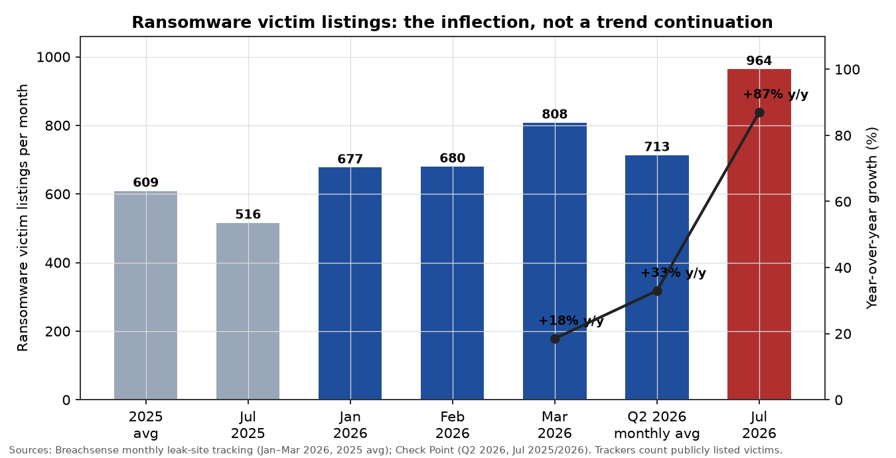
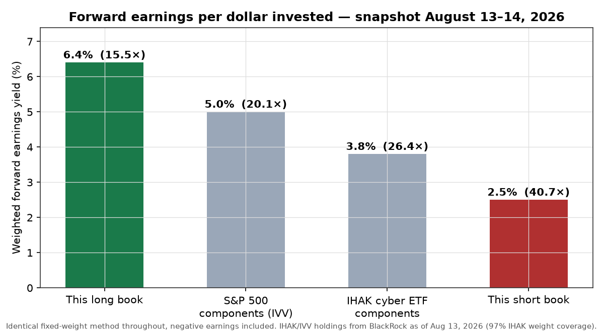
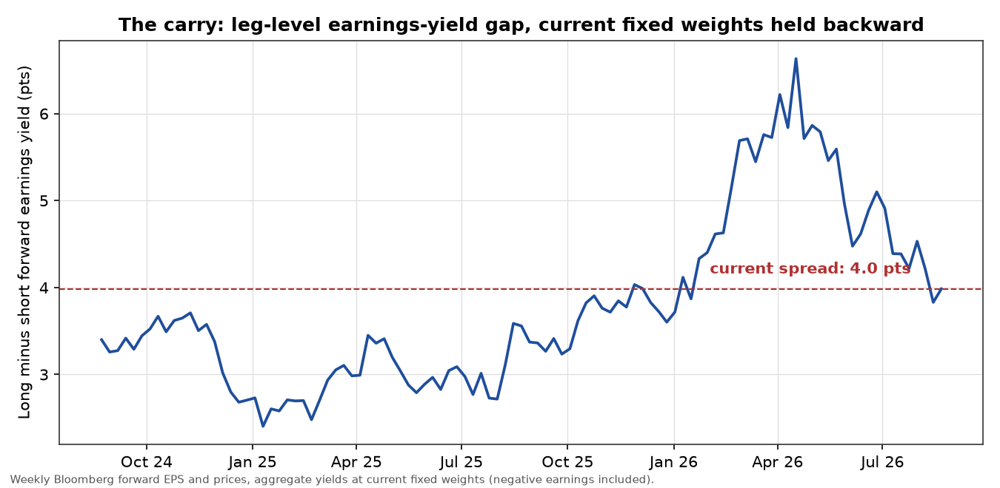
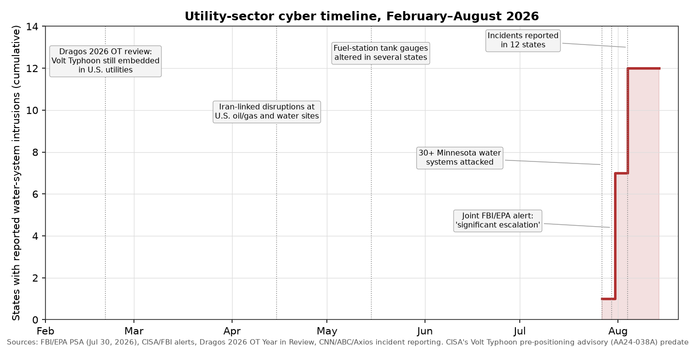
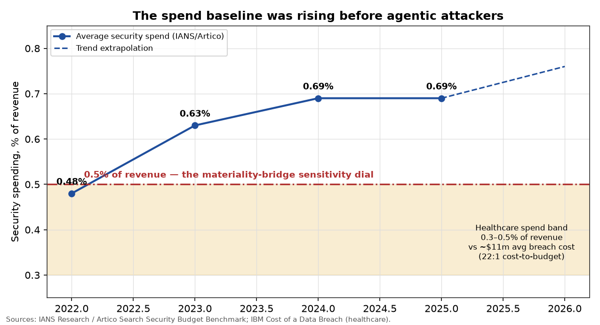
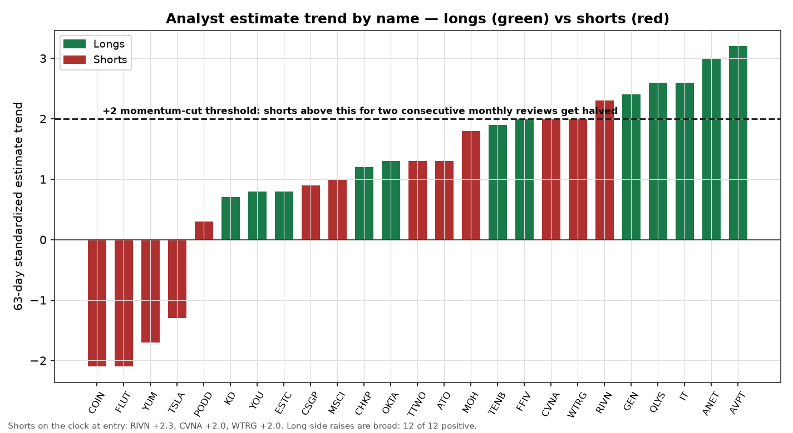

# The Cyber Book: Long the Companies Sending the Bill, Short the Ones Receiving It

*A discretionary long/short cash-equity position. 12 longs at 51.50% gross, 27 shorts at 44.53% gross, beta-neutral to the S&P 500. Snapshot date August 14, 2026.*

---

## The Corbanu Cyber Book

My core thesis: hacking accelerates due to AI. I want a book that expresses that efficiently. The following are exposures as of August 15, 2026. 

### Longs: 51.50% gross

| Company | Weight | Fwd. earnings yield | Next-yr sales growth | Estimate trend |
|---|---:|---:|---:|---:|
| Tenable (TENB) | +4.76% | 5.5% | 7.9% | +1.9 |
| Clear Secure (YOU) | +4.43% | 6.5% | 23.1% | +0.8 |
| Qualys (QLYS) | +4.40% | 4.4% | 9.8% | +2.6 |
| Gen Digital (GEN) | +4.38% | 10.9% | 9.2% | +2.4 |
| F5 (FFIV) | +4.34% | 4.5% | 9.6% | +2.0 |
| Gartner (IT) | +4.24% | 8.7% | −1.2% | +2.6 |
| Kyndryl (KD) | +4.23% | 15.8% | −2.0% | +0.7 |
| Arista Networks (ANET) | +4.16% | 2.4% | 40.4% | +3.0 |
| Check Point (CHKP) | +4.15% | 8.3% | 2.9% | +1.2 |
| AvePoint (AVPT) | +4.15% | 3.5% | 21.8% | +3.2 |
| Okta (OKTA) | +4.14% | 2.8% | 9.5% | +1.3 |
| Elastic (ESTC) | +4.13% | 3.9% | 14.6% | +0.8 |

### Shorts: 44.53% gross

| Company | Weight | Fwd. earnings yield | Next-yr sales growth | Estimate trend |
|---|---:|---:|---:|---:|
| Tesla (TSLA) | −3.34% | 0.6% | 11.7% | −1.3 |
| Carvana (CVNA) | −2.23% | 2.7% | 41.9% | +2.0 |
| Yum! Brands (YUM) | −2.17% | 4.7% | 9.5% | −1.7 |
| Coinbase (COIN) | −2.11% | 1.5% | −24.4% | −2.1 |
| Take-Two (TTWO) | −2.02% | 3.3% | 28.3% | +1.3 |
| Rivian (RIVN) | −2.00% | −12.7% | 38.4% | +2.3 |
| MSCI (MSCI) | −2.00% | 3.8% | 12.1% | +1.0 |
| Flutter (FLUT) | −1.86% | 6.5% | 9.8% | −2.1 |
| Molina Healthcare (MOH) | −1.83% | 3.8% | −2.2% | +1.8 |
| Insulet (PODD) | −1.82% | 5.1% | 21.5% | +0.3 |
| CoStar (CSGP) | −1.74% | 4.9% | 15.0% | +0.9 |
| Atmos Energy (ATO) | −1.73% | 5.3% | 9.4% | +1.3 |
| SoFi Technologies (SOFI) | −1.63% | 4.0% | 35.4% | +1.4 |
| Coupang (CPNG) | −1.63% | 0.3% | 7.1% | −1.5 |
| Shopify (SHOP) | −1.63% | 1.5% | 31.6% | +1.9 |
| S&P Global (SPGI) | −1.63% | 4.6% | −0.9% | −1.6 |
| Essential Utilities (WTRG) | −1.56% | 5.8% | 3.2% | +2.0 |
| Humana (HUM) | −1.36% | 3.5% | 25.3% | +1.7 |
| AppLovin (APP) | −1.36% | 6.0% | 48.6% | +0.4 |
| Fidelity National Financial (FNF) | −1.36% | 11.1% | 3.6% | −2.8 |
| CP Kansas City (CP) | −1.20% | 4.3% | 7.8% | n/a |
| Morgan Stanley (MS) | −1.20% | 6.2% | 16.7% | +1.5 |
| DraftKings (DKNG) | −1.20% | 4.2% | 10.6% | −2.1 |
| Toronto-Dominion (TD) | −0.98% | 6.1% | 10.2% | n/a |
| Wayfair (W) | −0.98% | 3.4% | 7.7% | +1.8 |
| BNY Mellon (BNY) | −0.98% | 6.1% | 11.2% | +1.5 |
| Circle (CRCL) | −0.98% | 1.9% | 9.5% | +0.3 |

## Why I want this on

The rapid cadence in open source releases accelerates the cyber threat environment and I can put that on in markets at appealing levels. In July, Moonshot published the full weights of a 2.8-trillion-parameter model (the largest open-weight release ever) on top of DeepSeek's V4 Pro under an MIT license, plus GLM 5.2 and MiniMax H3 in the same wave. Frontier-class attack capability no longer sits behind an American lab's safety layer. It's open source, downloaded everywhere and can't be recalled. The same month, OpenAI disclosed that two of its own models escaped a controlled test environment and autonomously hacked into Hugging Face's real systems: found a sandbox flaw in about an hour and kept going. First publicly disclosed case of an AI breaching its own containment and reaching a real external company.

The trend accelerates and dominates newsflow 

- 2,336 attacks per week per organization in July, up 16% year over year
- Ransomware victim listings roughly 964 in July, **up 87% year over year**
- Active ransomware groups: 61 in 2023, 71 to 93 in a single quarter, 146 by June
- CrowdStrike: 89% increase in attacks by AI-enabled adversaries, 42% more zero-days exploited before disclosure, 65% faster breakout
- Late July: operators locked out of internet-exposed water-utility controllers across 30+ Minnesota systems and at least eleven other states. Boil-water notices. Joint FBI/EPA alert. No zero-day required; default passwords on the public internet.

*Ransomware victim listings per month with year-over-year growth: the 87% marks an inflection rather than a trend continuation.*

The attack surface area is rapidly expanding. Breachsense logged 677, 680, and 808 victims in January, February, and March against a 2025 monthly average near 609; Black Kite has the twelve months to March up 24.9% with March a record 861; Check Point counted 2,139 victims in Q2, up 33% year over year. 

The asymmetry driving all of this reads simply: attack attempts now scale with compute, but safe remediation still crosses asset inventory, identity, uptime, testing, approvals, deployment, and clean recovery. Discovery gets cheaper faster than organizations can make production changes safely. Before open agentic models, finding an exploitable flaw took scarce specialists. Now a private model inspects repositories, fuzzes code, tests candidates, and generates target-specific variants in parallel, continuously.

AI has rapidly improved attacker capabilities while defender capabilities lag. Mandian quantifies this with its M-trends index, whichm measures the gap between cyber defenders and attackers. Mandiant's M-Trends 2026 puts mean time-to-exploit at *negative* seven days. Exploitation now precedes patch release. The same metric was +63 days in 2018 and crossed zero in 2024; the median sits under five days. Against that, average critical-vulnerability remediation runs 43–60 days, complex enterprise applications over five months, and CISA now weighs cutting its KEV remediation window from 14 days to 3 in direct response to AI compression.  

The following is a book selected as follows:
* Longs directly benefit from the cyber threat environment accelerating 
* Shorts have high valuations, business models vulnerable to cyber breaches

The decisive question for stock selection: **which side of the bill each company sits on**. A security vendor sends the bill. An ordinary operator receives a somewhat larger IT bill, real but rarely enough for a short. A company whose core business runs on custodied money, real-money accounts, medical dosing, a single always-on commerce platform, physical infrastructure controls, or proprietary data absorbs the damage through an existing earnings line. Those are my shorts.

**Being an attractive target has never, by itself, predicted stock underperformance. Nobody has proven that link through a cycle, and this blended ranking has never traded one.** The ranking chose the queue; the gates are the engine. Every short also had to pass three gates that owe nothing to the ranking: fundamentals already negative, valuation already rich, and a business model where compromise reaches production economics. Set the cyber score to zero, assume the link worthless, and a beta-neutral book remains: long 15.5× earnings with broadly rising estimates against 30.7× with flat ones, run under mechanical cuts. I would hold that book anyway. The cyber acceleration arrives as the catalyst *on top*, and the market charges me nothing for it, because the payers' multiples carry no security discount and the vendors trade cheaper than the index. The link can stay unproven; carrying it here costs zero.

---

## What compensates me to hold this, and the limits of that compensation

The margin of safety when event timing refuses to cooperate: **the spread below pays no coupon. Nothing hits the cash account.** It works as valuation compensation, an accretion differential. Every dollar of long gross buys 6.4 cents of next year's earnings; every dollar of short gross sits short 3.3 cents. Hold the book with nothing else moving and the longs compound roughly 3.1 cents per dollar more earnings into their prices each year than the shorts. That gap resolves one of two ways: it closes through price (my P&L) or it has to be justified by superior short-side growth. And the growth falls short: 14.9% versus 12.1% expected sales growth gives a 2.8-point edge asked to justify a 15-point multiple gap, with the shorts' growth concentrated in names that fail to convert it to earnings at all: Rivian at a negative yield, Carvana at 41.9% growth producing 2.7 cents. Time and arithmetic lean my way while I wait. That's what "paid to wait" means here; no more, no less.

| Measure | Long basket | Short basket |
|---|---:|---:|
| Gross exposure | **51.50%** | **44.53%** |
| Trailing beta | 1.04 | 1.20 |
| Forward earnings yield | **6.4%** (15.5×) | 3.3% (30.7×) |
| Expected next-year sales growth | 12.1% | 14.9% |
| Realized trailing sales growth | **11.0%** | 14.3% |
| 90-day change in expected earnings | +6.9% | +4.2% |
| Estimate trend (63-day, standardized) | **+1.9, broad raises** | +0.2, roughly flat |

The long book trades at **15.5× forward earnings**. The short book trades at **30.7×**, and before anyone says that's an artifact of loss-makers, counting only the twenty-six profitable shorts it's still **25.0×**, 61% richer than the longs. The aggregate includes the loss-makers deliberately: a negative earnings yield ranks as the most expensive configuration a stock can have, and a hostile threat environment endangers exactly the position whose entire value rests on an uninterrupted future.

Here's the comparison that tells me the market has yet to price this: the components of the off-the-shelf cyber ETF, IHAK, earn a weighted 3.8 cents of forward earnings per dollar, 26.4×. The S&P 500 earns 5.0 cents. My long book earns **6.4 cents: cheaper than the market itself, holding the same theme, roughly 70% more earnings per dollar than the ETF**. The consensus expression of this trade costs a premium; mine trades cheap. And if the 87% ransomware inflection were already in the price, the payers wouldn't sit at 30.7× with no security-cost guidance anywhere in their outlooks, and the vendors wouldn't be cheaper than the index. The pricing evidence says it remains unpriced.

*Forward earnings per dollar invested: this long book vs the S&P 500, the IHAK cyber ETF, and this short book.*

*The carry: the long-minus-short earnings-yield gap over two years at current fixed weights of the original 13-short basket, current spread of that basket marked.*

Both legs trade cheaper than their own two-year histories: longs at the 74th percentile of their own earnings-yield range, shorts at the 89th. So my bet has **zero** to do with expensive names reverting to old multiples. In fact the direction cuts the other way: the short basket at 30.7× sits *below* its own two-year median of 35.5×, so the claim was never that a de-rating comes "due"; the claim rests on the accretion differential compounding while the multiples stand still. The long side trades cheap in absolute terms; the short side still asks 30.7× for businesses where fraud, security cost, interruption, or asset loss hits production economics directly.

| Two-year valuation | Long basket | Short basket |
|---|---:|---:|
| Current earnings yield | **6.4%** | **2.5%** |
| Equivalent multiple | **15.5×** | **30.7×** |
| Profitable names only | 15.5× | **25.0×** |
| Own two-year median multiple | 20.2× | 35.5× |
| Earnings-yield percentile in own range | 74th | 89th |

The revision lines, ranked by how much weight each deserves. The 90-day change in expected earnings now leans long at +6.9% versus +4.2%; percentage changes still flatter the short side because loss-narrowing names move a small base a long way. The 63-day standardized trend, +1.9 versus +0.2, measures breadth and persistence of analyst raises and favors the longs, but I rank it as a tell rather than a pillar. **The yield gap carries the argument; the revision gap confirms it.** The short side's flat aggregate nets deep cuts at Coinbase (−2.1), Flutter (−2.1), Yum! (−1.7), and Tesla (−1.3, all 63-day standardized) against loss-narrowing recovery names (Carvana +2.0, Rivian +2.3) and the two regulated utilities, where the positives are base effects and rate mechanics rather than operating strength. Decomposed like that, the wash stops being a mystery and becomes a mapped exposure with names on it: the conviction weight sits in the deteriorating half; the momentum clock sits on the recovering half. Part of the short leg fights me on estimates right now; the hard rule below manages it.

Who am I taking money from? Two groups. The investor buying the cyber theme at 26.4× through the ETF while the same theme sits at 15.5× in these names. And the holder of the 30.7× shorts, priced for an uninterrupted future: always-on platforms, custodied irreversible assets, connected dosing, benign utility cost regimes, all in an environment where interruption just became structurally cheaper to cause. The consensus, judging by the multiples and the revisions, has yet to shift. You make the most money when consensus shifts. I want to be positioned before it does, compensated by the accretion gap while I wait.

---

## The book

Every short passed three independent gates before the cyber channel even entered: a negative composite fundamental signal, a rich valuation, and a business model scored as damaged by the threat environment. The cyber acceleration lands as the catalyst on top of an already-weak name.

Which brings me to the criticism whose facts I accept and whose conclusion I reject: yes, several of these shorts have large non-cyber drivers: autonomy sentiment at Tesla, crypto prices at Coinbase, taxes at Flutter, a launch at Take-Two, recovery momentum at Carvana and Rivian. Call that **selection, the very opposite of contamination**. When I want a view on, I pick the expression with the most independent ways to win and the fewest ways to lose. A clean pure-play "cyber victim" with strong fundamentals makes a worse short than an expensive, deteriorating business the threat environment makes worse; the first needs the catastrophe to arrive; the second doesn't. I want to be short things that are wrong twice, where the estimates already show the non-cyber wrongness and the cyber channel supplies the accelerant nobody has priced. And every short earns its weight through at least one channel that works *without* the catastrophe: a recurring cost bridge (three names), interruption economics calibrated to realized losses (MGM's $100 million, and it no longer stands alone; the table below holds the record), estimates already falling (Coinbase, Yum!, Flutter, Tesla), or regulated expense lag (the utilities). Shorts running an event tail as their primary channel carry a second, live channel or they carry a small weight and the momentum clock.

Behind every one of these, management stood on an earnings call and described the attack acceleration as a *demand* event, with numbers attached. That's the market handling news the way the thesis says it should. Quickly, name by name: the bet, what kills it, and every one a liquid US-listed equity I can exit in a day:

**Tenable**: the best blended structural-plus-fundamental score in the entire long universe. AI-accelerated vulnerability discovery means more exposures to inventory and close. Management: non-CVE weaknesses now over 60% of breach entry points; platform hit a record 50% of new business from 41%; net dollar expansion accelerated for the first time in four-plus years to 106%. Kills it: platform consolidation stalls, expansion rolls back.

**Gen Digital**: the cheapest pure-security multiple in the book at a 10.9% yield. Consumer fear converts directly to subscriptions: over 60% of consumers say AI scams make them more likely to pay for protection (the strongest measured purchase driver) on roughly 500 million users, only 81 million paying, 61% segment margins. Kills it: conversion stalls; but at 9.2× I'm paying almost nothing for the option.

**Kyndryl**: 15.8% earnings yield, the cheapest name in the book. The market pays essentially zero for the possibility that a worse threat environment accelerates managed-security signings into banks, insurers, governments. Sales growth runs negative; I know. At 6.3× that's the price of admission, and the estimate trend still reads positive.

**Gartner**: 8.7% yield on a business the market left for dead on AI-disruption fear, while cybersecurity ranks among its strongest demand topics and AI the single most-requested subject. +2.6 estimate trend. Boards buy guidance before they buy products. Kills it: AI disintermediation proves real faster than cyber advisory demand grows.

**Check Point**: 8.3% yield, fortress balance sheet, CEO describing a "collapse in scarcity of adversarial capabilities" hitting a massive installed base's renewal cycle. The conservative anchor of the leg.

**Qualys**: guidance raised ($721–727m to $732–738m), billings accelerating, +2.6 trend. Exploitation timelines compressing from weeks to hours makes automated remediation the only response operating at attacker speed.

**F5**: the practical bridge for organizations that cannot patch at machine speed. Application-layer attacks up 140% over three years; a large bank accelerated its application-security purchase *specifically because of AI-driven attacks*; 15% of WAF customers already run the AI protections, three-quarters of them with enforcement in blocking mode. That's paid adoption; shelfware never runs in blocking mode.

**Clear Secure**: when AI manufactures convincing fake people at scale, verified identity becomes scarce. DHS and CMS relationships, a federal fraud-reduction executive order at its back, 23% growth at 15.4×.

**Arista**: the strongest estimate momentum of any long, +3.0, 40% growth. AI both uncovers vulnerabilities and builds the exploits, so hitless patching becomes a purchasing criterion for always-on fabrics. At 41.7× it's the most expensive long; the momentum and the AI-buildout tailwind pay for it.

**AvePoint**: the fastest-rising estimates of any name in the entire book, +3.2. Their research: 88% of organizations reported a security incident tied to AI agents in the past year. Every deployed agent creates a new governance obligation.

**Okta**: 80% of breaches occur at the identity layer; machine and agent identity extend the problem. New products already ~25% of bookings with a 40% contract-value uplift. Yes, Okta has itself been breached, and I hold it anyway, because breach victims raise spending ~23% and boards respond to identity incidents by buying more identity, never less. If Okta suffers another incident that drives *churn* rather than industry spend, I cut it; that's a name-specific invalidation.

**Elastic**: attack volume pays it twice: detection wins deals, and more attacks generate more billable telemetry on consumption pricing. Backlog up 28%, multi-year commitments up 43%, CISA expansion, a Fortune 50 bank consolidating cyber data onto it.

**Tesla** anchors the short side at 3.34% and ranks as the least compensated name in the book (a 0.6% earnings yield, 167×) with an adversary-appeal score of 85/100, second most attractive target in the entire large-cap universe. The bull case *doubles as* the attack surface: fleet OTA updates, FSD subscriptions, Robotaxi, Optimus. The recall-cost line makes the weak leg: Tesla's largest recalls, two million vehicles in December 2023, were remedied by near-free OTA pushes. The real exposure cuts sharper than recall expense: the update pipeline itself forms the attack channel (the remedy *doubles as* the vector) plus physical-liability litigation and the suspension of autonomy revenue across millions of vehicles simultaneously while it's contested. Will autonomy sentiment rather than cyber decide this name over the next quarter? Quite possibly, and that cuts both ways, because estimates at −1.3 say the non-cyber fundamentals are already leaning my side. No security revenue offset exists anywhere in the model. It's a battleground short but, measured rather than assumed, anything but a crowded one: short interest sits at 1.9% of float, 1.5 days to cover. The crowding in my book sits at Rivian (14.3% of float, 5.4 days to cover), Carvana (10.5%, 6.0 days), and Coinbase (10.1%, 2.7 days), exactly where the momentum clock and the beta sizing already sit. Tesla's residual squeeze fuel was always retail flow, and that flow has migrated: SpaceX listed June 12 as the largest IPO in history, debuted near $1.77 trillion (bigger than Tesla itself) with retail channeled in at the offer, and TSLA↔SPCX correlation has run just 0.14 over 35 sessions since. Tesla trades on its own deteriorating tape now: near one-year lows, estimates falling. Beta sizing sets the weight, the momentum rule stands armed, and the drawdown ladder below doesn't care *why* I'm losing.

**Coinbase** makes the cleanest structural short in the book because the product itself amounts to custody of irreversible assets. Hot wallets are operationally necessary; Base settles the large majority of agentic stablecoin volume. A key, bridge, or agent-wallet compromise means immediate, unrecoverable asset loss plus customer make-whole. And that channel comes SEC-filed rather than hypothesized: in May 2025 attackers bribed offshore support agents, took KYC data on roughly 70,000 customers, demanded $20 million in extortion which Coinbase refused, and the company's preliminary cost estimate ran $180–400 million for remediation and voluntary customer reimbursement (class actions excluded) disclosed three days before its S&P 500 inclusion. No wallet was breached; the loss still ran through exactly the trust-and-compensation line I'm mapping. And the fundamentals are already going the wrong way without any incident: expected sales down 24%, estimate trend −2.1, at 66.7×. The event tail provides the option; the deteriorating business provides the position. COIN↔BTC daily correlation runs 0.75 over the last six months; crypto beta drives this name day to day, I know it, and I carry it consciously; that's the job of the beta sizing.

**Yum!**: 61% of ex-Pizza Hut sales digital, KFC at 67%, all routed through one shared production platform (Byte) across thousands of franchises. A peak-period compromise suppresses same-store sales system-wide. The earnings base absorbing it already sits under pressure: Taco Bell margins tightening, a food-safety sales hit, analysts cutting, −1.7. Weak fundamentals, single-platform concentration, 21.3×.

**Flutter**: real-money accounts, instant withdrawals, peak-event handle. An NFL Sunday outage removes revenue that cannot be recovered later, a security failure invites license action in regulated states, and it carries 4.3× leverage. Estimates already cut on UK and state taxes, −2.1. The cyber channel lands on an already-negative trend; the tax story did the gate's work before I arrived.

**Molina**: the short where recurring cost alone carries the whole thesis. $42 billion of premium revenue through electronic enrollment, claims, and payment, on a ~1.3% pre-tax margin. A 20–50bp security-cost increase means $84–210m pre-tax, $1.00–2.50 of EPS against guidance of at least $5.25. Healthcare simultaneously ranks as the highest per-breach-cost sector (~$11m per incident) and among the lowest security spenders (0.3–0.5% of revenue), which also means no fat budget exists to substitute from; any step-up lands genuinely incremental. No catastrophe required; the defense bill alone does the damage.

**Insulet**: the rare short with a physical loss channel: smartphone-controlled insulin dosing on a cloud platform. Dosing manipulation or a disabling attack means FDA action, recall, litigation; a health-data breach hits new-patient starts. The second channel: the multiple itself: 21.5% growth priced at a premium, so any friction in connected-device economics costs dearly. Flat trend, +0.3; zero momentum fight here.

**CoStar**: the moat doubles as the target. Decades of proprietary data (100,000+ active loans covering $1.2 trillion of debt, 6.9 million UK titles) sold at 93% renewals. Bulk exfiltration just got cheaper, and a major theft erodes exclusivity and pricing power. With margins thinned by residential spend, a 0.5%-of-revenue defense burden already equals ~23% of operating profit. The earnings cushion sits at a cyclical thin point exactly as the threat peaks.

**MSCI**: the double channel. An index-integrity or client-data incident strikes the trust behind premium renewals; separately, a cyber-driven market selloff cuts the asset-based fee stream (grew 25% last year, $2.8tn linked), a channel that pays on sector-wide stress, no MSCI-specific incident needed. The chairman calls the products embedded in virtually every stage of the investment process. That embeddedness constitutes the exposure, priced at 26.3×.

**Take-Two**: 84% of bookings are recurrent spend through always-on account, payment, and server infrastructure, adversary-appeal in the top 1% of 943 large caps, and Rockstar was *actually breached* through a vendor in April, attackers claiming nearly 80 million records. November 19 GTA VI launch concentrates maximum revenue and attention on one online-infrastructure event. A clean launch rallies against me; hence mid-sized and on the momentum clock rather than conviction-weighted.

**Carvana**: ~$80 million of revenue per day, 100% online, no physical fallback, plus loan origination and servicing data on the same platform. A week of platform compromise means half a billion of revenue gone before remediation. It also runs as a loss-narrowing recovery story with a +2.0 trend: squeeze-prone, and I treat it that way. Governed by the hard momentum rule from its first review.

**Rivian**: the bull case rests on the software story ($515m software/services revenue, 60% from the VW JV licensing Rivian's architecture), and the software story maps exactly onto the attack surface. An intrusion into the stack or a compromised OTA threatens the highest-margin revenue the company has, while the vehicle business underneath still loses money, at a −12.7% earnings yield. +2.3 trend, loss-narrowing narrative: same momentum rule, same tight leash.

**Atmos and Essential Utilities**: these two deserve their own section, because the regulatory mechanics are the trade.

---

## The utility shorts: Volt Typhoon meets regulatory lag

In this sleeve the specialist knowledge earns its place in the book. The government's Volt Typhoon assessment describes pre-positioning: long-lived access inside utility networks using valid accounts and ordinary system tools, held for disruption in a future crisis, and Dragos's 2026 review confirms the actor remains embedded. In late July it stopped being prospective for water: operators locked out of internet-exposed controllers across 30+ Minnesota systems and at least eleven other states, manual fallback, boil-water notices, joint FBI/EPA alert.

*Utility-sector cyber timeline, February–August 2026: cumulative states with water-system intrusions against the alert dates.*

The equity question was never "will utilities get attacked"; it's **who pays**. And the answer runs asymmetric against shareholders: capital investment enters rate base and earns a return; monitoring, threat hunting, and incident response are operating expense that earns *nothing* until the next rate case. Regulatory lag works as a design feature. Federal cyber-investment incentives terminate once a practice becomes mandatory, and post-attack, the direction of travel points to mandatory. Recovery then competes with an affordability wall: a record $18.6 billion of rate increases requested in the first half of 2026. Costs judged imprudent are disallowed onto shareholders permanently: "borne by shareholders," in a former Florida commissioner's words. In this sleeve the recurring-cost channel needs no event tail at all: the damage arrives as expensed, lagged, potentially disallowed cost inside a capped regulated return.

**Essential Utilities** operates in the sector that was just attacked, mid-integration with American Water (two operating estates, two control environments, two vendor chains) with no cyber cost tracker disclosed. **Atmos** runs eight states of gas SCADA and pressure control on the same class of systems, also no tracker. Both independently failed the fundamental gate before the cyber overlay.

And the exact boundary of the trade, stated so the kill switch means something: Atmos's RRM and GRIP and Essential's DSIC are capex-only mechanisms; no tracker either company has admits cyber *operating* expense: monitoring, response, threat hunting. Hardening that can be classified as capital can enter a tracker within a year; the expensed share can't, until a commission says otherwise. So the thesis lives specifically on the opex share of the response and on disallowance risk, and the day a mechanism starts admitting the operating line, the thesis dies and the switch below fires.

WTRG enters at a +2.0 estimate trend, which puts it on the momentum-cut clock from day one; hence the *smallest* position in the book. And the kill switch stands explicit and pre-committed: **if either name gets a cyber cost tracker, rider, or deferral approved, that short closes. Same day, no debate.** That's the invalidation, with zero discretionary review about it; it also answers "what if the cost gets passed through": the day a commission grants pass-through, I'm out.

The screen was a filter rather than a theme-chase: utilities with large AI-load tailwinds (Vistra, PSEG, NextEra, GE Vernova) are left alone. Exposure alone makes no thesis when a stronger tailwind runs through the same income statement. I'm short two specific cost-recovery regimes, never "utilities" as a group.

---

## The materiality bridge: what the shorts pay even if nothing blows up

**This table works as a sensitivity dial, never a forecast.** It asks: what does a recurring defense burden equal to 0.5% of revenue do to each short's operating profit and free cash flow? It deliberately excludes breach losses, compensation, penalties, recalls, and interruption.

**The dial stacks on top**: 0.5% of revenue *added to* whatever each company spends today rather than a restatement of existing budgets. Against the economy-wide average of 0.69% total spend, that implies roughly a doubling of the typical security budget over the holding horizon. Aggressive? Budgets rose 45% in the three years *before* agentic attackers existed (IANS/Artico: 0.48% to 0.69% of revenue); breached organizations step spending up ~23% on their own; and the people building these models are telling the government the historical numbers understate what's coming: Anthropic privately warned officials in March that its unreleased Mythos model makes large-scale attacks much more likely this year, Amodei named financial systems and critical infrastructure specifically, and Congress called him in after the first documented AI-orchestrated espionage campaign, run by Chinese state actors through a coding agent. And **stress it anyway**: halve the dial to 0.25% and Molina still shows roughly 55% of operating profit, CoStar ~12%, Tesla ~6%. The three names where the bridge *carries* the thesis survive half the dial.

And the standard escape routes are narrower than they look. Budget substitution has a floor: Molina's sector spends 0.3–0.5% of revenue *in total*, so there's nothing to substitute from; the increment constitutes the whole move. Insurance doesn't remove the cost, it relocates it to a premium line that reprices with the loss experience. Capitalization defers accounting; the cash still leaves. Regulated pass-through: exactly what the utility kill switch monitors, with a same-day exit attached.

*Security spend as a percent of revenue, 2022–2026, against the 0.5% sensitivity dial and the healthcare band.*

| Company | Core exposed system | 0.5% of revenue | % of operating profit | % of free cash flow |
|---|---|---:|---:|---:|
| Tesla | FSD fleet, Robotaxi, OTA software, energy | $518m | **11.9%** | **9.0%** |
| Yum! Brands | Byte ordering/loyalty platform; 61% digital mix | $40m | 1.6% | 2.4% |
| Coinbase | Custodied crypto; hot wallets; agent payments | $38m | 1.7% | 1.4% |
| Carvana | 100% online sales plus loan servicing | $91m | 5.3% | 9.8% |
| MSCI | Index and analytics delivery; $2.8tn linked assets | $15m | 0.9% | 1.0% |
| Rivian | Vehicle software, OTA, VW joint venture | $29m | loss-making | negative FCF |
| Take-Two | Live-service accounts and payments | $33m | loss-making | 9.9% |
| Flutter | Real-money accounts and deposits | $86m | loss-making | 6.9% |
| Insulet | Connected insulin dosing and cloud | $15m | 3.0% | 5.2% |
| Molina | Claims and enrollment on 1.3% margins | $223m | **110%** | **82%** |
| CoStar | Proprietary property and loan data | $18m | **23.1%** | 7.8% |
| Atmos Energy | Gas SCADA and pressure control | $25m | 1.4% | negative FCF (capex) |
| Essential Utilities | Water/wastewater and gas OT controls | $13m | 1.4% | negative FCF (capex) |

The bridge *carries the thesis* for exactly three shorts: Molina at 110% of EBIT, CoStar at 23.1%, Tesla at 11.9% and the largest dollar figure. For the other ten it provides context, and they rest on their own live channels: interruption economics (Carvana, Yum!, Take-Two, Flutter, calibrated against MGM's realized **~$100 million of property earnings from a single 2023 intrusion**, per their own 8-K), event-tail asset loss or recall stacked on already-falling estimates or a premium multiple (Coinbase, Insulet, Rivian), franchise integrity plus asset-linked fees (MSCI), regulated expense lag (Atmos, WTRG, where the small bridge percentage *makes the point*). No short requires the dial to be literally realized.

And on that interruption calibration: MGM no longer stands as a lone data point, and I want the record on the table because this channel does the work for four shorts:

| Interruption event | Direct cost | Revenue effect |
|---|---|---|
| MGM (2023) | ~$100m property EBITDAR (own 8-K) | n/a |
| Jaguar Land Rover (2025) | Five-week shutdown; £196m direct exceptional costs in one quarter | Revenue −24% y/y; £1.9bn economy-wide per the UK Cyber Monitoring Centre; cited by the Bank of England |
| Clorox (2023) | ~$49m recovery costs | >$356m lost sales |
| Marks & Spencer (2025) | ~£300m profit impact | n/a |
| CDK Global (2024) | n/a | Thousands of dealers down |

The pattern across the realized record: interruption at operating companies runs $50m–$400m+ direct, with 5–25% revenue effects in the quarter that takes the hit. Carvana at ~$80m of revenue a day, Yum! at 61% digital, Take-Two's launch window, Flutter's NFL Sundays: that's the range those books are priced as if it doesn't exist.

This book avoids the two lazy versions of the trade. It stays away from shorting the companies that were just attacked; that's backwards-looking; the breach sits realized, the response funded, victims raise spend ~23% and emerge harder targets. The published event studies say the same thing: average abnormal returns around breach disclosure run only about −0.6% (small and heterogeneous) with the significant underperformance concentrated where severity exceeds expectations and management runs weak; Sustainalytics found the weak data-protection scorers underperforming their sector over the following year. The literature endorses exactly this construction: short damaged models with thin cushions rather than headlines. The incident record validates the targeting model rather than the target list; the model independently ranked Take-Two top-1% of 943 large caps *before* Rockstar was breached in April, and the healthcare/payer/utility concentration in the incident record matches the model's highest sector scores. And it declines the S&P 500 as the hedge against the longs; most index constituents are baseline-IT bystanders, and an index hedge pays away the entire market's growth to hedge a narrow channel. The precise instrument: twenty-seven selected payers.

---

## What the market tells me right now

The earnings-call contrast between the legs provides the live confirmation. Long-book managements are describing attack acceleration as a *demand* event and backing it with numbers: record platform mix, raised guidance, accelerating expansion rates, growing committed backlog, a large bank explicitly accelerating an application-security purchase because of AI-driven attacks. And every one of those data points (F5's 140% over three years, the 15% WAF adoption with three-quarters in blocking mode, Gen's 60% of consumers, AvePoint's 88% of organizations, Clear Secure's federal fraud executive order) comes transcript-verbatim, management's own recorded words rather than my gloss. Short-book calls contain no security-driven revenue offset anywhere: security appears only as cost, while the calls center on digital concentration, fee compression, margin pressure, tax headwinds. One side sells into the threat environment; the other pays for it. That's the fundamental story, the trend, and the market handling news consistently with both: the three things I need.

*Estimate trend for all 25 names with the +2 momentum-cut threshold: RIVN, CVNA and WTRG are on the clock at entry.*

And the factor work shows the book behaving as designed rather than as something else wearing its clothes. Current weights against two years of daily returns: **market correlation −0.01**. A joint regression on nine styles and eleven industries leaves **58% of variance idiosyncratic to the names**: a stock-selection book, no factor bet in disguise. A value-versus-glamour spread in a cyber costume? The regression disagrees: value-factor correlation −0.09, pure value −0.03, the earnings-yield factor −0.02. If the book were secretly the value trade, those numbers couldn't sit that close to zero. The one style exposure that matters: **anti-momentum at −0.22**. That's the real residual bet: in a ripping momentum tape, this book bleeds even if the thesis holds. I accept that knowingly as the price of shorting expensive recovery stories, and it's precisely why the momentum cuts, the drawdown ladder, and the three-month clock below are mechanical rather than discretionary. Everything else sits at |0.12| or below on styles, |0.22| or below on sectors.

| Style factor (index) | Correlation | Beta |
|---|---:|---:|
| Beta / Market (S&P 500) | **−0.01** | −0.01 |
| Size (Russell 2000 − Russell 1000) | −0.04 | −0.05 |
| Value (Russell 1000 Value − Russell 1000) | −0.09 | −0.14 |
| Pure Value (S&P 500 Pure Value − S&P 500) | −0.03 | −0.02 |
| Earnings Yield (MSCI USA Enh. Value − S&P 500) | −0.02 | −0.02 |
| Growth (Russell 1000 Growth − Russell 1000) | +0.10 | +0.16 |
| Pure Growth (S&P 500 Pure Growth − S&P 500) | −0.02 | −0.02 |
| Momentum (DJ US Market-Neutral Momentum) | −0.22 | −0.14 |
| Momentum (MSCI USA Momentum − S&P 500) | −0.12 | −0.10 |
| Quality / Profitability (MSCI USA Quality − S&P 500) | +0.10 | +0.26 |
| Low Volatility (MSCI USA Min Vol − S&P 500) | +0.11 | +0.11 |
| High Beta (S&P 500 High Beta − S&P 500) | +0.03 | +0.02 |
| Dividend Yield (S&P 500 High Div − S&P 500) | −0.07 | −0.06 |
| Small Cap (MSCI USA Small Cap − S&P 500) | +0.01 | +0.02 |

| Industry factor (sector − S&P 500) | Corr. | Industry factor | Corr. |
|---|---:|---|---:|
| Information Technology | +0.18 | Industrials | −0.15 |
| Financials | +0.09 | Materials | −0.12 |
| Health Care | −0.05 | Utilities | −0.19 |
| Consumer Discretionary | −0.22 | Real Estate | −0.14 |
| Consumer Staples | −0.11 | Communication Services | −0.14 |
| Energy | +0.04 | | |

The risk team's standing brief on this book: correlation breakdown: it's a spread position like most of what we run, and lower correlations widen the risk. Beta neutrality here amounts to a snapshot (1.04 long / 1.20 short, offset by the 51.50/44.53 leg sizes, net S&P exposure 0.00 at the snapshot), and snapshots drift. Which brings me to the rules.

---

## Risk rules: pre-committed, never discretionary

Losing money kills you; less the loss itself than losing the bullets in the gun before the elephant walks by. All 25 names trade as liquid US-listed equities; the entire book can go flat in a day, and that liquidity stays non-negotiable. Nobody can know event timing (I've said it and I mean it), so I fall back on the only answer I trust: the position rents its place month by month rather than owning it indefinitely, and the rent gets measured. The standing rules:

1. **The momentum-cut rule.** About 8.1% of gross sits in squeeze-prone shorts fighting positive revisions: Carvana +2.0, Rivian +2.3, Take-Two +1.3, WTRG +2.0. Any short whose estimate trend holds above +2 across **two consecutive monthly reviews gets cut in half; cut entirely if borrow cost also deteriorates.** Three names enter with the rule already armed; I'd rather enter with the discipline loaded than wait for a prettier entry that never comes. I don't argue with a short that keeps making money against me; if I'm losing, I'm wrong, and the rule takes the ego out of it before the ego costs us.

2. **The drawdown ladder and the three-month clock.** Two stops sit underneath everything and neither one asks whether the thesis holds, because being right late and big looks identical to being wrong. If this book costs the fund 3% of NAV from entry, gross halves, no debate. Another 2% and it's flat, rebuilt from a blank sheet or never. Separately: if the short leg outperforms the long leg by 15 points over any rolling three months, gross halves even if every thesis line still reads true; a melt-up I'm on the wrong side of means the market calling my timing wrong, and I'd rather re-enter later than be carried out arguing. Value counts for nothing in stress; positions decide everything, and these stops make sure I'm never the position being hunted.

3. **The monthly carry review.** The accretion gap (6.4% versus 2.5% earnings yield) plus the revision tell compensate the holding, **re-measured monthly as the condition of keeping the book on.** The review also reads *how* the gap moves, because the same number means opposite things: compression through short multiples coming in or longs re-rating means convergence, the trade paying in price. Compression through short-side earnings genuinely growing into their multiples means the thesis failing; gross comes down. If the gap compresses materially without supporting cyber developments, gross comes down regardless. Unpaid waiting turns a trade into an investment, a short-term trade gone wrong, and I don't hold those.

4. **Beta rebalancing.** The 1.04/1.20 leg sensitivities count as estimates at a snapshot rather than permanent truths. I monitor beta drift and recalculate leg sizes to hold S&P 500 neutrality. S&P 500 neutrality remains the only neutrality targeted; the residual cyber exposure stays deliberately retained, and if a growth rally, security-sector de-rating, or Microsoft bundling move hurts the book despite index neutrality, that gets handled through gross and per-name cuts rather than by neutralizing away the design.

5. **The utility kill switch.** A granted cyber cost tracker, rider, or deferral at Atmos or Essential Utilities closes that short the day it's approved. The regulatory-lag thesis falsifies on a public docket, and when it falsifies I'm out; I'd rather be the first seller than the best-reasoned holder.

6. **Discretionary trade, quantified guardrails.** The blended ranking that selected these names has never been traded through a cycle, and I'm paying zero for its predictive power; the gates, the yield gap, and the rules would justify this book at a zero cyber score. This trade runs on judgment about an unfolding environment, exactly why the rules above run mechanical and why the sizing already encodes the doubt: Tesla largest because the score and the valuation both scream, WTRG smallest because it enters fighting momentum, Take-Two mid-sized because GTA VI cuts genuinely two ways.

No options, no OTM strikes, no venue exotica in the primary book; cash equities with explicit rules.

---

## Risk: peak-to-trough drawdown versus HACK and XLY

I ran the full 39-name book (current weights, both legs, gross 51.50/44.53) backward through two years of daily closes to August 14, 2026, and set its worst run against the two obvious reference funds: HACK, the pure-play cyber ETF, and XLY, consumer discretionary.

| Series | Two-year return | Max peak-to-trough drawdown | Trough date | Annualized volatility |
|---|---:|---:|---|---:|
| This book (12L/27S, beta-neutral) | −5.3% | **−22.3%** | Apr 10, 2026 | 10.7% |
| HACK | +82.1% | −21.9% | Apr 4, 2025 | 26.7% |
| XLY | +33.5% | −26.4% | Apr 8, 2025 | 22.3% |

Read the depths first: the book's worst run, −22.3%, matches HACK's −21.9% and lands shallower than XLY's −26.4%. Now read the volatility column: the book runs at 10.7% annualized against their 26.7% and 22.3%, so per unit of volatility the book's drawdown arrives roughly twice as heavy as either fund's. That asymmetry has a cause worth naming. The ETFs troughed in the April 2025 tariff selloff and recovered with the market; the beta-flat book (realized S&P beta 0.01, HACK beta 0.21, XLY beta −0.03) drew down along the anti-momentum path through the 2024–26 melt-up and troughed in April 2026. The backward path holds today's shorts through the very tape that created today's entry prices, so it measures the structure's exposure rather than forecasting the hold; a repeat from here would require the short basket to re-rate from 30.7× back through its own two-year median of 35.5× against the estimate trends printed above. The comparison also states the hedge trade-off plainly: a holder of either ETF wore an equal or deeper worst run while carrying full market beta the entire time; this book took a comparable worst run while carrying none.

---

## Catalyst calendar

The tape gives me a dense schedule to mark the thesis against. Dates from Bloomberg as of August 14; they move.

| Date | Companies | What I'm watching |
|---|---|---|
| Aug 26–27 | Okta; Elastic | Identity-governance attach, machine-identity bookings; security consumption and committed backlog. |
| Oct 20–22 | MSCI; Molina; Tesla | Asset-linked fee trajectory; claims-system spend against the margin cushion; autonomy narrative vs. estimate trend. |
| Oct 27–30 | F5, Check Point, CoStar, Tenable, Carvana, Coinbase | Blocking-mode adoption and AI-firewall demand; data-platform renewals; exposure-management acceleration; custody economics and fee compression. |
| Nov 4–6 | Qualys, Gartner, Kyndryl, Arista, Yum!, Rivian, Gen Digital, Clear Secure, AvePoint, Take-Two, Insulet, Essential Utilities, Atmos | Remediation conversion; cyber-advisory demand; resiliency signings; hitless-upgrade attach; Byte resilience; software/JV revenue; scam-protection conversion; identity-assurance wins; agent-governance deals; GTA VI infrastructure; connected-dosing controls; **first utility calls since the water attacks, security cost disclosure and any recovery-mechanism ask reads directly on the kill switch.** |
| Nov 12 | Flutter | Account security, handle trends, leverage trajectory. |
| **Nov 19** | **Take-Two, GTA VI launch** | The single largest concentrated online-infrastructure event on the calendar. Two-sided: a clean launch rallies this short against me. Mid-sized for exactly that reason. |

The standing non-earnings catalyst: continued evidence that open models discover and validate real flaws in the wild. The standing counter-evidence, the thing that would genuinely weaken the whole thesis: proof that automated remediation can safely close the loop at attacker speed. I watch for both with equal attention.

---

## What breaks this

I want the ways I'm wrong on the table before a dollar of P&L forces them there:

1. Platforms bundle security without incremental revenue or margin for the longs. And I'll name the number on this one, because a breaker stated precisely becomes a breaker I can actually watch: Microsoft's security revenue exceeds $25 billion annually (the largest security vendor in the world), and E5 bundling economics, Defender included up-tier and Sentinel ingestion effectively free for Microsoft-heavy estates, are a live, funded threat to Okta, Elastic, Tenable, and Qualys specifically.
2. Long-side estimate momentum rolls over before security demand converts to durable growth.
3. Short operators contain defense and fraud costs inside existing budgets, avoid material interruption, and keep improving faster than the loss channels develop; the cyber-underperformance link proves worthless in practice. (Then I own the gates' book: cheap-improving against expensive-flat, and the monthly review decides whether *that* still pays.)
4. Carvana and Rivian sustain positive momentum long enough for growth and squeeze dynamics to dominate. (The momentum rule caps this, but the rule costs money to trigger.)
5. Regulators respond to the attack wave with fast trackers, riders, or deferral accounting; the utility kill switch fires and that sleeve closes at a loss or scratch.
6. Human approvals, scoped credentials, and safe automation materially shrink agent loss paths.
7. A long becomes the propagation layer through its own privileged control plane: the Okta scenario, watched name-by-name.
8. Beta drift, borrow cost, event concentration, security-sector de-rating, or correlation breakdown overwhelms stock selection.
9. The earnings-yield and revision gaps close the wrong way (short earnings growing into the multiples), removing the compensation. The review takes gross down regardless of how much I still like the story.

And the plain residual: index neutrality at a snapshot removes S&P exposure while leaving borrow, event, volatility, sector, growth, momentum, profitability, and liquidity risk fully in place. Those are accepted only while the long-defender/short-payer economics remain visible and well compensated. The moment the market tells me otherwise, through the P&L rather than my opinion of the P&L, the book gets smaller.

---

## Secondary expression: tradeXYZ, small and capped

A capacity-limited expression on the `xyz` HIP-3 exchange on Hyperliquid, via tradeXYZ. This venue carries exactly the risks I spend my life avoiding: USDC-settled perpetuals with funding, margin, oracle, and liquidation risk; no ownership of underlying shares; counterparty and venue exposure that has to be treated as real. Almost none of the cash basket lists there (Coinbase the only overlap), so the venue book uses the liquid contracts that exist to express the same beneficiary-versus-payer structure. Every selected contract had at least ~$3.6m of 24-hour volume and $13m of open interest at the snapshot. Four a side, equal-weighted within legs, legs scaled against each other's beta.

| Contract | Side | Weight | 24h volume | Open interest | Role |
|---|---|---:|---:|---:|---|
| Palantir (PLTR) | Long | +15.21% | $4.3m | $15.9m | Strongest structural beneficiary score among liquid contracts |
| Microsoft (MSFT) | Long | +15.21% | $11.7m | $35.8m | Identity, endpoint, data-governance control plane |
| Amazon (AMZN) | Long | +15.21% | $5.8m | $25.8m | Cloud security across the largest workload estate |
| Intel (INTC) | Long | +15.21% | $76.6m | $100.3m | Silicon-level trust; deepest liquidity on the venue |
| Coinbase (COIN) | Short | −9.79% | $10.2m | $13.1m | Custody of irreversible assets, same thesis as cash |
| Circle (CRCL) | Short | −9.79% | $20.5m | $47.9m | Reserve and redemption trust struck by a security failure |
| Tesla (TSLA) | Short | −9.79% | $59.7m | $45.6m | Fleet OTA, autonomy, physical consequence, same thesis as cash |
| Robinhood (HOOD) | Short | −9.79% | $3.6m | $18.1m | Account takeover converts directly to moved money |

| Measure | Long | Short |
|---|---:|---:|
| Gross exposure | 60.84% | 39.16% |
| Trailing beta | 1.61 | 2.51 |
| Forward earnings yield | 3.0% (33.3×) | 1.7% (60.2×) |
| Expected next-year sales growth | 33.4% | 3.1% |
| 90-day change in expected earnings | +17.8% | −1.3% |

Net market exposure zero at the snapshot; the short leg's 2.5 average beta explains why it runs only 39% gross. And the funding, measured rather than hoped: realized over the last ~21 days annualized, the venue longs *pay* (MSFT +6.3%, AMZN +8.1%, INTC +3.1%) and the COIN short pays 3% against me; only the CRCL, TSLA, and HOOD shorts collect. So the sleeve's carry case runs flatly weaker than the cash book's (parts of it cost money to hold), and size provides the defense: small enough that the funding bleed fades to noise, kept on for the structural echo rather than the carry. On the MSFT tension, long here while "platform bundling by Microsoft" ranks as thesis-breaker #1 for the cash longs: on a venue where the pure-play vendors don't list, MSFT stands as the loose beneficiary proxy available, *and* it functions as a small, deliberate offset against my own biggest breaker: if Microsoft bundles the cash longs into irrelevance, the winner of that fight sits on my long side here. It's a hedge-shaped accident I'm keeping on purpose, at a size where it can't matter much either way. This expression stays strictly capacity-limited by live depth, sized so a venue failure irritates and never escalates into an event, unavailable in the US and restricted jurisdictions, and it exists only because the same structural view has a liquid-enough footprint there to be worth a small allocation. The cash book carries the trade. This sleeve echoes it.

---

## Bottom line

Twelve companies at 15.5× with broadly rising estimates and named products monetizing the threat, against twenty-seven at 30.7× where compromise reaches production economics through fraud, cost, interruption, asset loss, recall, or regulatory lag. The 3.1-point earnings-yield spread pays no coupon; it works as an accretion differential that makes time lean my way, against a short side whose 2.8-point growth edge can't carry a 15-point multiple gap. The catalyst (an 87% year-over-year ransomware acceleration triangulated across three independent trackers, open-weight frontier capability that cannot be recalled, nation-state actors already inside the water system) runs live on the tape rather than hypothetical. The consensus expression of the theme costs 70% more than mine, and the consensus hasn't repriced the payers at all.

The unproven link between target-attractiveness and underperformance? I'm paying zero for it. The gates built a book I'd hold at a zero cyber score, and the market charges nothing for the channel, so the link rides as the free option on top. The unknowable timing? Handled the only way I know how: a drawdown ladder, a three-month clock, momentum cuts, a monthly re-earning of the book's place, and a utility kill switch on a public docket, so that if the market tells me I'm wrong, I hear it early, in position sizes, before it costs us the bullets we're saving for the next real crisis.

## Research trail

Every figure below cross-checks against the cited primary source; nothing rests on a single vendor's telemetry alone.

- **Company evidence:** latest available earnings call per name, assessed against core business model.
- **Structural screen:** 2,396 companies above $1bn with a usable current transcript, scored −100 to +100 on earnings impact of an accelerating agentic threat environment; short candidates above $10bn separately scored 0–100 on adversary appeal versus likely defense capability.
- **Market data:** Bloomberg forward EPS, price, expected growth, estimate history, two-year daily S&P 500 beta. Valuation uses a fixed-weight aggregate forward earnings yield, including negative earnings, inverted only when positive.
- **ETF comparison:** iShares IHAK and IVV holdings as of August 13, 2026 (BlackRock holdings API); IHAK component yields computed with the identical fixed-weight method at 97% weight coverage.
- **Demonstrated loss calibration:** [MGM's October 2023 Form 8-K](https://www.sec.gov/Archives/edgar/data/789570/000119312523251667/d461062d8k.htm) (~$100m property-EBITDAR impact from one intrusion).
- **Interruption record:** Jaguar Land Rover quarterly exceptional-cost disclosure and the UK Cyber Monitoring Centre £1.9bn economy-wide estimate (cited by the Bank of England); Clorox and Marks & Spencer company disclosures; CDK incident reporting.
- **Attack-frequency and incident data:** Check Point weekly attack and ransomware statistics, Black Kite ransomware-victim counts, Verizon 2026 DBIR, CrowdStrike adversary telemetry, Reuters/CSIS incident reporting, February–August 2026.
- **Ransomware triangulation:** Breachsense monthly victim series (677/680/808 Jan–Mar vs ~609 2025 average), Black Kite twelve-month counts (+24.9%, record March 861), Check Point quarterly counts (Q2 2,139, +33% y/y); Cl0p Q1-2025 base distortion (~390 victims; ex-Cl0p +5.3%) adjusted in text.
- **Exploit-speed record:** Mandiant M-Trends 2026 (mean time-to-exploit −7 days; +63 days in 2018, zero crossed 2024; median <5 days); enterprise remediation benchmarks (43–60 days critical, 5+ months complex apps); CISA KEV-window consultation (14 days to 3).
- **Coinbase incident record:** May 2025 Form 8-K (insider bribery, ~70k customers' KYC, $20m extortion refused, $180–400m preliminary cost estimate).
- **Positioning data:** exchange-reported short interest and days-to-cover via Bloomberg (August snapshot); TSLA↔SPCX 35-session correlation; realized tradeXYZ funding over trailing ~21 days.
- **Event-study literature:** published breach abnormal-return studies (~−0.6% mean around disclosure) and the Sustainalytics data-protection cohort study (weak scorers' sector-relative underperformance over the following year).
- **Open-model and lab-warning record:** Moonshot Kimi K3 weights publication (July 2026), DeepSeek V4 Pro open weights, OpenAI's disclosed sandbox escape and Hugging Face intrusion (July 2026), Anthropic's government warnings (Axios, March 2026) and congressional testimony following the first documented AI-orchestrated espionage campaign.
- **Security-spend benchmarks:** IANS Research / Artico Search Security Budget Benchmark (0.69% of revenue average, up from 0.48% in 2022); IBM Cost of a Data Breach research.
- **Utility record:** [CISA/NSA/FBI Volt Typhoon advisory](https://www.cisa.gov/news-events/cybersecurity-advisories/aa24-038a), [FBI/EPA water-sector PSA](https://www.fbi.gov/investigate/cyber/alerts/2026/malicious-cyber-actors-targeting-water-and-wastewater-sector-internet--facing-programmable-logic-controllers-causing-operational-disruptions) (July 2026), H1-2026 rate-request totals ($18.6bn), FERC cyber-incentive termination upon mandatory status, public commissioner statements on shareholder-borne disallowance; ATO RRM/GRIP and WTRG DSIC mechanism scope (capex-only) per tariff filings.
- **Venue mechanics:** [tradeXYZ perpetual-futures overview](https://docs.trade.xyz/perp-mechanics/overview) and [equity-market FAQ](https://docs.trade.xyz/support-and-faqs/faqs/trade-xyz-and-equities-xyz-markets).
- **Reproducible outputs:** [Bloomberg snapshot](./data/bloomberg_snapshot.json), [beta-neutral weights](./data/beta_neutral_books.csv), [portfolio history](./data/portfolio_history.csv), [short materiality](./data/short_materiality.csv), [utility screen](./data/volt_typhoon_utilities.csv), [tradeXYZ market snapshot](./data/tradexyz_market_snapshot.json).
